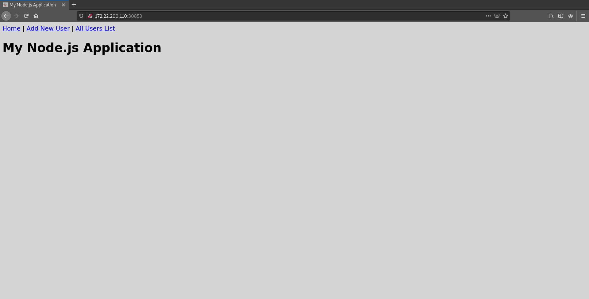
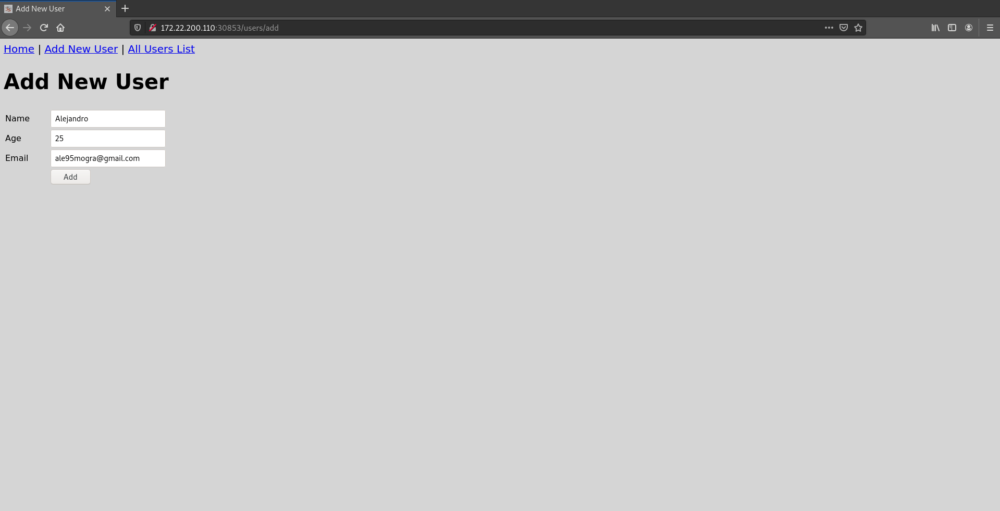
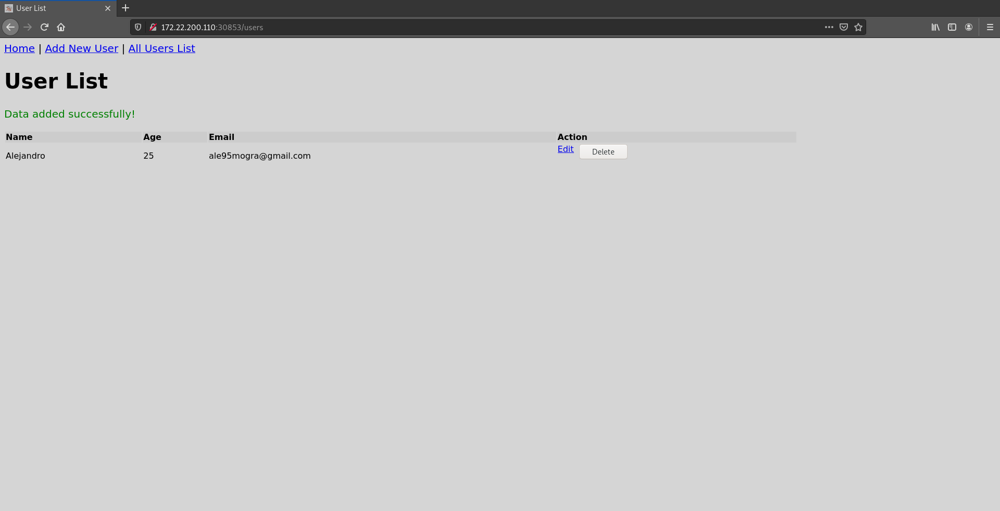

# Despliegues de microservicios en k8s con Helm (y OpenShift)

Helm es un administrador de paquetes para Kubernetes, que ayuda en el proceso de gestión de versiones a desplegar, su empaquetado, proceso de release (forward, rollback, upgrade), etc... de una manera más fácil y rápida.

Estos paquetes se denominan chart, los cuales son una colección de ficheros que describen un conjunto de recursos del API de Kubernetes. Un ejemplo comparable para entenderlo sería el caso del `apt` o `yum` o otros administradores de paquetes de distribuciones de linux pero para Kubernetes.

Las claves de la utilización de Helm son:

* Instalar automáticamente dependencias de software.
* Utilización de chart para la empaquetación de nuestras aplicaciones.
* Insteractuar con repositorios de chart, ya sean públicos o privados.
* Los Helm Charts sirven para describir incluso las aplicaciones más complejas. Ofrecen una instalación repetible de la aplicación, manteniendo un único punto de control.
* El proceso de “rollback” con Helm Charts es sencillo.
* Las actualizaciones de Helm Charts son sencillas y más fáciles de utilizar para los desarrolladores.
* Gestionar el ciclo de vida de despliegue de chart que han sido instaladas con Helm.

Helm es un proyecto oficial de Kubernetes y se esta empezado a utilizar mucho por la facilidad de los usuarios a la hora de trabajar con los paquetes de Kubernetes. Es mantenido por la CNCF en colaboración con Microsoft, Google, Bitnami y la comunidad de Helm.

En resumen, la principal función de Helm es definir, instalar y actualizar aplicaciones complejas de Kubernetes.

#### Requisitos previos

-------------------

* Un clúster de Kubernetes en la versión 1.8 o posterior, con el control de acceso en roles (RBAC) hablitado. Si necesita ayuda para instalar Kubernetes con kubeadm [LEER AQUÍ](https://github.com/MoralG/Trabajando_con_Kubernetes/blob/master/Trabajando_con_Kubernetes.md)

###### Comprobar la versión de Kubernetes:
~~~
kubectl version
    Client Version: version.Info{Major:"1", Minor:"18", GitVersion:"v1.18.2",   GitCommit:"52c56ce7a8272c798dbc29846288d7cd9fbae032", GitTreeState:"clean",   BuildDate:"2020-04-16T11:56:40Z", GoVersion:"go1.13.9", Compiler:"gc", Platform:"linux/amd64"}
    Server Version: version.Info{Major:"1", Minor:"18", GitVersion:"v1.18.2",   GitCommit:"52c56ce7a8272c798dbc29846288d7cd9fbae032", GitTreeState:"clean",   BuildDate:"2020-04-16T11:48:36Z", GoVersion:"go1.13.9", Compiler:"gc", Platform:"linux/amd64"}
~~~

--------------------------------------

* Tener la herramienta de líneas de comando `kubectl` instalada en su equipo local, configurada para poder conectarse al clúster.

###### Comprobar la conectividad:
~~~
kubectl cluster-info
    Kubernetes master is running at https://10.0.0.10:6443
    KubeDNS is running at https://10.0.0.10:6443/api/v1/namespaces/kube-system/services/kube-dns:dns/proxy
~~~

----------------

## Instalación de Helm

Vamos a instala la herramienta de linea de comando `helm` en nuestro equipo local de trabajo.

Descargamos la última release de Helm de la versión 3. Para hacer esto nos vamos a la [página oficial](https://github.com/helm/helm/releases) y nos descargamos el fichero `.tar.gz` para Linux

> #### NOTA 
> -----------------------
> Es recomendable que nos descarguemos una versión que este **Verificada**.

En el momento de la creación de este tutorial, nos descargamos la versión 3.2.0 de Helm.
~~~
wget https://get.helm.sh/helm-v3.3.4-linux-amd64.tar.gz
~~~

Descromprimimos el fichero:
~~~
tar -zxvf helm-v3.3.4-linux-amd64.tar.gz
~~~

Tenemos que mover el binario del directorio que hemos desempaquetado a la dirección, en mi caso, `/usr/local/bin/helm`

~~~
sudo mv linux-amd64/helm /usr/local/bin/helm
~~~

Comprobamos la versión
~~~
helm version
    version.BuildInfo{Version:"v3.2.0", GitCommit:"e11b7ce3b12db2941e90399e874513fbd24bcb71",   GitTreeState:"clean", GoVersion:"go1.13.10"}
~~~


> ##### NOTA
> --------------------
> Para mayor seguridad es recomendable quitar los permisos de lectura a los grupos para el fichero de configuración del cluster.
> Ejecutamos el siguiente comando:
> ````shell
> sudo chmod 600 /home/debian/.kube/mycluster.conf
> ````


Ya tenemos instalado Helm en la version 3, lo siguiente que vamos a ver es como iniciar el repositorio chart de Helm.

### Agregando un Helm Chart Repository

Vamos a agregar el repositorio de chart de Helm para poder instalar los chart que queramos.

~~~
helm repo add stable https://kubernetes-charts.storage.googleapis.com/
    "stable" has been added to your repositories
~~~

Una vez agregado, podemos listar los chart con el siguiente comando:

~~~
helm search repo stable
~~~

Nos saldrá una lista de chart oficiales para poder instalar en nuestro cluster

~~~
NAME                                 	CHART VERSION	APP VERSION            	DESCRIPTION
stable/acs-engine-autoscaler         	2.2.2        	2.1.1                  	DEPRECATED Scales worker nodes within agent pools
stable/aerospike                     	0.3.2        	v4.5.0.5               	A Helm chart for Aerospike in Kubernetes
stable/airflow                       	6.7.1        	1.10.4                 	Airflow is a platform to programmatically autho...
stable/ambassador                    	5.3.1        	0.86.1                 	A Helm chart for Datawire Ambassador
.
.
.
~~~

## Guía rápida

### Instalando un Chart oficial

Vamos a instalar un chart del repositorio oficial de Helm, para hacer esto tenemos que actualizar primero la información de los chart disponibles en el repositorio `stable` con el comando `helm repo update`.

> #### ESTRUCTURA DEL COMANDO
> --------------------
>* **`helm repo update [flags]`**
>
>###### [Para saber más sobre los comandos de helm](https://helm.sh/docs/helm/helm_repo_update/) o utilice `helm help` para una descripción general o utilice el parámetro `-h` para una descripción de un comando concreto

~~~
helm repo update
    Hang tight while we grab the latest from your chart repositories...
    ...Successfully got an update from the "stable" chart repository
    Update Complete. ⎈ Happy Helming!⎈
~~~

No ha salido un mensaje de que esta todo actualizado, ahora vamos a proceder a instalar un chart. En nuestro caso vamos a probar con MySQL.

Antes de empezar a instalar, tenenemos que saber el nombre del chart, para eso utilizamos el comando `helm search repo`.

> #### ESTRUCTURA DEL COMANDO
> --------------------
> * **`helm search repo [keyword] [flags]`**
> 
> ###### [Para saber más sobre los comandos de helm](https://helm.sh/docs/helm/helm_search_repo/) o utilice `helm help` para una descripción general o utilice el parámetro `-h` para una descripción de un comando concreto

Vamos a buscar la **release stable** de mysql, pero si queremos otras versiones podemos utilizar la flags `--devel` para prerelease o `--version [version]` para que nos muestre la version concreta.

~~~
helm search repo mysql
    NAME                            	CHART VERSION	APP VERSION	    DESCRIPTION
    stable/mysql                    	1.6.3        	5.7.28     	Fast, reliable, scalable, and easy to   use open-...
    stable/mysqldump                	2.6.0        	2.4.1      	A Helm chart to help backup MySQL   databases usi...
    stable/prometheus-mysql-exporter	0.5.2        	v0.11.0    	A Helm chart for prometheus mysql   exporter with...
    stable/percona                  	1.2.1        	5.7.26     	free, fully compatible, enhanced, open  source d...
    stable/percona-xtradb-cluster   	1.0.3        	5.7.19     	free, fully compatible, enhanced, open  source d...
    stable/phpmyadmin               	4.3.5        	5.0.1      	DEPRECATED phpMyAdmin is an mysql   administratio...
    stable/gcloud-sqlproxy          	0.6.1        	1.11       	DEPRECATED Google Cloud SQL     Proxy
    stable/mariadb                  	7.3.14       	10.3.22    	DEPRECATED Fast, reliable, scalable,    and easy t...
~~~

Nos ha listado todo lo que tiene que ver con el término **mysql** en su versión estable. Ahora vamos a instalar el chart **stable/mysql** con la versión 1.6.3 del chart.

Para instalar un chart tenemos que utilizar el comando `helm install`.

> #### ESTRUCTURA DEL COMANDO
> --------------------
> * **`helm install [NAME] [CHART] [flags]`**
> 
> ###### [Para saber más sobre los comandos de helm](https://helm.sh/docs/helm/helm_install/) o utilice `helm help` para una descripción general o utilice el parámetro `-h` para una descripción de un comando concreto

Vamos a asignarle el nombre de **maria** a nuestro chart, pero podemos utilizar la flags `--generate-name`para asignarle uno automáticamente.

~~~
helm install maria stable/mysql
~~~

Al instalar dicho chart, en el caso de mysql, nos sale una información del chart, como se muestra a continuación:

~~~
NAME: maria
LAST DEPLOYED: Thu Apr 23 17:09:13 2020
NAMESPACE: default
STATUS: deployed
REVISION: 1
NOTES:
MySQL can be accessed via port 3306 on the following DNS name from within your cluster:
maria-mysql.default.svc.cluster.local

To get your root password run:

    MYSQL_ROOT_PASSWORD=$(kubectl get secret --namespace default maria-mysql -o jsonpath="{.data.mysql-root-password}" | base64 --decode; echo)

To connect to your database:

1. Run an Ubuntu pod that you can use as a client:

    kubectl run -i --tty ubuntu --image=ubuntu:16.04 --restart=Never -- bash -il

2. Install the mysql client:

    $ apt-get update && apt-get install mysql-client -y

3. Connect using the mysql cli, then provide your password:
    $ mysql -h maria-mysql -p

To connect to your database directly from outside the K8s cluster:
    MYSQL_HOST=127.0.0.1
    MYSQL_PORT=3306

    # Execute the following command to route the connection:
    kubectl port-forward svc/maria-mysql 3306

    mysql -h ${MYSQL_HOST} -P${MYSQL_PORT} -u root -p${MYSQL_ROOT_PASSWORD}
~~~

> #### NOTA
> --------------------
> Si queremos ver la opciones configurables de un chart, podemos usar `helm show values <nombre_chart>`
> ~~~
> helm show values stable/mariadb
> ## Global Docker image parameters
> ## Please, note that this will override the image parameters, including dependencies, configured to use > the global value
> ## Current available global Docker image parameters: imageRegistry and imagePullSecrets
> ##
> # global:
> #   imageRegistry: myRegistryName
> #   imagePullSecrets:
> #     - myRegistryKeySecretName
> #   storageClass: myStorageClass
>
> ## Use an alternate scheduler, e.g. "stork".
> ## ref: https://kubernetes.io/docs/tasks/administer-cluster/configure-multiple-schedulers/
> ##
> # schedulerName:
>
> ## Bitnami MariaDB image
> ## ref: https://hub.docker.com/r/bitnami/mariadb/tags/
> ##
> image:
>   registry: docker.io
>   repository: bitnami/mariadb
>   tag: 10.3.22-debian-10-r27
> .
> .
> .
> ~~~
> Sabiendo las opciones que podemos configurar, podemos modificarlar de dos maneras:
> * Indicandole los parámetros en un fichero `.yaml` y luego indicarle dicho fichero en la instalación del chart.
>
> Creamos el fichero `yaml` indicandole las opciones
> ~~~
> echo '{mariadbUser: usuario1, mariadbDatabase: usuario_bd}' > prueba.yaml
> ~~~
> Indicamos el fichero `yaml` en la instalación, con el parámetro `-f`
> ~~~
> helm install -f prueba.yaml stable/mariadb --generate-name
> ~~~
> * Le indicamos las opciones con el parametro `--set`, en el moemnto de la instalación
> ~~~
> helm install stable/mariadb --generate-name --set name=usuario1
> ~~~

Ya tenemos instalado nuestro chart y nos muestra varia información, como la descripción, el nombre, el namespace, etc. Pero además nos muestra la instrucciones para conectarse a la base de datos.

Para ver los chart que estan lanzados con Helm podemos utilizar el comando `helm ls`.


~~~
helm ls
    NAME 	NAMESPACE	REVISION	UPDATED                                	STATUS  	CHART      	APP     VERSION
    maria	default  	1       	2020-04-23 17:39:05.877933281 +0000 UTC	deployed	mysql-1.6.3	5.7.28
~~~
### Actualizando un versión

Cuando se lanza una nueva versión de un chart, cuando desea cambiar la configuración de este, podemos usar `helm upgrade`

Una actualización toma una versión existente y la actualiza de acuerdo con la información que proporciones, en el caso de Helm solo se actualiza las cosas qie no han cambiado desde la última versión.

En este caso, para ver un ejemplo, vamos a cambiar la configuración del chart instalado anteriormente. Vamos a crear un fichero `yaml` con la opción `mariadbUser` modificada y creareamos una nueva versión.

~~~
echo '{mariadbUser: usuario1}' > prueba.yaml
~~~

~~~
helm upgrade -f prueba.yaml maria stable/mariadb
~~~

~~~
helm get values maria
    USER-SUPPLIED VALUES:
    mariadbUser: usuario1
~~~

~~~
helm history maria
    REVISION	UPDATED                 	STATUS     	CHART         	APP VERSION	DESCRIPTION
    1       	Thu Apr 23 16:30:03 2020	deployed   	mysql-1.6.3   	5.7.28    	Upgrade complete
~~~

### Desinstalando una versión

Para desinstalar una versión tenenemos que utilizar el comando `helm uninstall`.


> #### ESTRUCTURA DEL COMANDO
> --------------------
> * **`helm uninstall RELEASE_NAME [...] [flags]`**
> 
> ###### [Para saber más sobre los comandos de helm](https://helm.sh/docs/helm/helm_plugin_uninstall/) o utilice `helm help` para una descripción general o utilice el parámetro `-h` para una descripción de un comando concreto


Vamos a realizar la desinstalación del chart **maria** pero vamos a añadir el flag `--feep-history` para mantener el historial de versión.

~~~
helm uninstall maria --keep-history
    release "maria" uninstalled
~~~

Con este flag lo que conseguimos es poder rastrear las versiones incluso después de haberlas desinstalado, podiendo auditar el historial de un cluster e incluso recuperar una versión con el comando `helm rollback`.

Podemos ver con el comando `helm status`, el estado actual del chart.

~~~
helm status maria
NAME: maria
LAST DEPLOYED: Thu Apr 23 17:39:05 2020
NAMESPACE: default
STATUS: uninstalled
.
.
.
~~~

Nos muestra que ha sido desinstalada.

### Realizar un Rollback

Vamos a realizar un rollback para revertir una release a una versión anterior con el comando `helm rollback`.

> #### ESTRUCTURA DEL COMANDO
> --------------------
> * **`helm rollback <RELEASE> [REVISION] [flags]`**
> 
> ###### [Para saber más sobre los comandos de helm](https://helm.sh/docs/helm/helm_rollback/) o utilice `helm help` para una descripción general o utilice el parámetro `-h` para una descripción de un comando concreto

Si hemos borrado una versión de un chart y por consiguiente, no nos sale con el comando `helm ls` vamos a tener que utilizar `helm history`.

~~~
helm history maria
    REVISION	UPDATED                 	STATUS     	CHART      	APP VERSION	DESCRIPTION
    1       	Thu Apr 23 16:30:03 2020	deployed   	mysql-1.6.3   	5.7.28    	Upgrade complete
    2       	Thu Apr 23 17:39:05 2020	uninstalled	mysql-1.6.3	    5.7.28     	Uninstallation complete
~~~

Sabiendo esto vamos a realizar el **rollback**.

~~~
helm rollback maria 1
    Rollback was a success! Happy Helming!
~~~

Nos ha indicado que esta todo correcto y listamos de nuemo con `helm ls` los chart lanzados:

~~~
helm ls
    NAME 	NAMESPACE	REVISION	UPDATED                               	STATUS  	CHART      	APP     VERSION
    maria	default  	2       	2020-04-23 17:51:41.84658262 +0000 UTC	deployed	mysql-1.6.3	5.7.    28
~~~

Como podemos ver, el chart **maria** aparece de nuevo pero con una diferencia, la revisión es la número 2.

También podemos ver con `helm history` que nos aparece la revisión 1 desinstalada y la revisión 2 lanzada.

~~~
helm history maria
    REVISION	UPDATED                 	STATUS     	CHART      	APP VERSION	DESCRIPTION
    1       	Thu Apr 23 16:30:03 2020	deployed   	mysql-1.6.3   	5.7.28    	Upgrade complete
    2       	Thu Apr 23 17:39:05 2020	uninstalled	mysql-1.6.3	    5.7.28     	Uninstallation complete
    3       	Thu Apr 23 17:51:41 2020	deployed	mysql-1.6.3	    5.7.28     	Uninstallation complete
~~~

## Creando Charts en Helm

En esta guía vamos a desarrollar nuestros propios Charts en Helm. Es recomentable que se mire antes la [Instalación y configuración](https://github.com/MoralG/Despliegues_de_microservicios_en_k8s_con_Helm_y_OpenShift/blob/master/Proyecto.md#instalaci%C3%B3n-de-helm) de Helm y la [Guía rápida](https://github.com/MoralG/Despliegues_de_microservicios_en_k8s_con_Helm_y_OpenShift/blob/master/Proyecto.md#gu%C3%ADa-r%C3%A1pida).

Si quiere saber el funcionamiento de algunos comando de Helm puede ir a la [Guía de comando]() de Helm.

Un Chart es una colección de ficheros que describen un cojunto de recursos de Kubernetes. Podemos usar un solo chart para implementar un pod memcached, o si nos vamos a algo mas complicado, una pila completa de aplicaciones web con servidores HTTP, bases de datos, cache, etc.

Es bueno tener unas prácticas recomendadas para realizar crear un chart de Helm, por eso vamos a ir paso a paso creando una aplicación en php y dando recomendaciones.

Vamos a empezar creando el chart:

***debian@cliente:***~* **$** ``helm create app-python3``
~~~
Creating app-python3
~~~

Al crear un Chart, dispondremos de unos directorios en forma de árbol, los cuales podemos modificar y una vez terminado la modificación, empaquetarlo en archivos versionados para su implementación.

~~~
app-crud/
├── charts
|   └──
├── Chart.yaml
├── templates
│   ├── deployment.yaml
│   ├── _helpers.tpl
│   ├── ingress.yaml
│   ├── NOTES.txt
│   ├── service.yaml
│   └── tests
│       └── test-connection.yaml
└── values.yaml

3 directories, 8 files
~~~

Vamos a repasar los ficheros y directorios necesarios para realizar un buen despligue en Kubernetes.

|Objeto          | Descripción
|----------------|-------------------------------
|**charts/**| Directorio donde de añadiran los chart que necesitemos como dependencias.
|**Chart.yaml**| Fichero yaml que contiene la información del chart.
|**README.md**| Fichero utilizado para la descripción del chart.
|**values.yaml**| Fichero que contiene los distintos valores por defectos que le pasamos al chart.
|**templates/**| Directorio donde añadiremos los recursos de Kubernetes. Añadiremos los diferentes objetos mediante ficheros yaml.
|**templates/NOTES.txt**| Fichero opcional, que contiene breves notas de uso, estas se muestran al terminar el comando `helm install`.
|**templates/_helpers.tpl**| Fichero opcional, utilizado para añadir valores que pueden ser reutilizables en todo el chart.

A partir de aquí tenemos que preguntarnos que vamos a necesitar.

* ¿Que imagen o imagenes vamos a utilizar?
* ¿Que dependencias necesitamos definir?
* ¿Para nuestra aplicación necesitamos volumenes persistentes?

### Fichero Chart.yaml

Para empezar vamos a modificar los metadatos del fichero `Chart.yaml`.

***debian@cliente:***~/app-crud* **$** `nano Chart.yaml`

```yaml
apiVersion: v1
appVersion: "1.0.0"
description: Aplicacion CRUD en Helm chart con express.js y mongodb.
name: app-crud
version: 0.1.0
sources:
- https://github.com/MoralG/appCRUD
maintainers:
- name: moralg
  email: ale95mogra@gmail.com
icon: https://res.cloudinary.com/practicaldev/image/fetch/s--5IllY723--/c_imagga_scale,f_auto,fl_progressive,h_900,q_auto,w_1600/https://thepracticaldev.s3.amazonaws.com/i/a3exuz06e9h212pandfr.png
```

Ahora vamos a definir las dependencias, dado que nuestra aplicación necesita la base de datos mongodb, debemos especificarla en el fichero `Chart.yaml` con el campo `dependencies`.

```yaml
dependencies:
- name: mongodb
 version: latest
 repository: https://kubernetes-charts.storage.googleapis.com/
 condition: mongodb.enabled
```

Ya tenemos las dependencias definidas, ahora hay que sincronizar las dependencias deseadas y las dependencias reales almacenadas en el directorio `chart/`, para esto vamos a utilizar el comando `helm dep update`.

> #### ESTRUCTURA DEL COMANDO
> --------------------
>* **`helm dep update CHART [flags]`**
>
>###### [Para saber más sobre los comandos de helm](https://helm.sh/docs/helm/helm_dependency_update/) o utilice `helm help` para una descripción general o utilice el parámetro `-h` para una descripción de un comando concreto

***debian@cliente:***~/app-crud* **$** `helm dep update`

```shell
Hang tight while we grab the latest from your chart repositories...
...Successfully got an update from the "django" chart repository
...Successfully got an update from the "bitnami" chart repository
...Unable to get an update from the "stable" chart repository (https://charts.helm.sh/stable):
        Get "https://charts.helm.sh/stable/index.yaml": dial tcp: lookup charts.helm.sh on 192.168.202.2:53: server misbehaving
Update Complete. ⎈Happy Helming!⎈
Saving 1 charts
Downloading mongodb from repo https://kubernetes-charts.storage.googleapis.com/
Deleting outdated charts
```

Como muestra en la salida del comando anterior, un chart se ha guardado. Comprobamos que se ha guardado en el directorio `chart/`.

***debian@cliente:***~/app-crud* **$** `ls -l charts/`

~~~
-rw-r--r-- 1 debian debian 5742 Nov 30 09:27 mongodb-2.0.5.tgz
~~~

### Fichero deployment.yaml

Lo siguiente que tenemos que hacer es modificar un poco el fichero `deployment.yaml`, que es el recurso que se va a encargar de definir el control de réplicas, escabilidad de pods, etc...

Añadimos algunas label, para tener un control y una comodidad a la hora de listar y trabajar con los objetos que vamos a crear.

```yaml
labels:
  app: {{ template "express-crud.name" . }}
  chart: {{ template "express-crud.chart" . }}
  release: {{ .Release.Name }}
  heritage: {{ .Release.Service }}
```

Añadimos variables de entornos configurar los valores del chart de mongodb.

```yaml
env:
- name: DATABASE_USER
  value: '{{ .Values.mongodb.mongodbUsername }}'
- name: DATABASE_NAME
  value: '{{ .Values.mongodb.mongodbDatabase }}'
- name: DATABASE_HOST
  value: '{{ .Release.Name }}-mongodb'
- name: DATABASE_PORT
  value: '27017'
- name: DATABASE_PASSWORD
  valueFrom:
    secretKeyRef:
      name: {{ .Release.Name }}-mongodb
      key: mongodb-password
```

 *Valores del fichero `values.yaml` referentes a la parte de `Values.mongodb`:
```yaml
mongodb:
  mongodbRootPassword:
  mongodbUsername: admin
  mongodbPassword:
  mongodbDatabase: test
```

Cambiamos el parámetro `image` para actualizar el chart de Helm con una nueva versión de la aplicación simplemente cambiando el valor en `Chart.yaml`.

```yaml
image: "{{ .Values.image.repository }}:{{ default .Chart.AppVersion .Values.image.tag }}"
```

* Valores del fichero `values.yaml` referentes a la parte de `Values.image`:
```yaml
image:
  repository: jainishshah17/express-mongo-crud
  # tag: 1.0.1
  pullPolicy: IfNotPresent
```

Añadimos las siguientes lineas para poder modificar los valores referente al puerto internos, protocolo, etc, desde el fichero `values.yaml`.

```yaml
ports:
- name: {{ .Values.service.name }}
  containerPort: {{ .Values.service.internalPort }}
  protocol: {{ .Values.service.protocol }}
```

Siempre es bueno agregar una prueba liveness y readiness para verificar el estado continuo de la aplicación. Para esto se utiliza las sondas.

```yaml
livenessProbe:
  httpGet:
    path: {{ .Values.livenessProbe.path }}
    port: {{ .Values.livenessProbe.port }}
  initialDelaySeconds: {{ .Values.livenessProbe.initialDelaySeconds }}
  periodSeconds: {{ .Values.livenessProbe.periodSeconds }}
  failureThreshold: {{ .Values.livenessProbe.failureThreshold }}
readinessProbe:
  httpGet:
    path: {{ .Values.readinessProbe.path }}
    port: {{ .Values.readinessProbe.port }}
  initialDelaySeconds: { .Values.readinessProbe.initialDelaySeconds }}
  periodSeconds: {{ .Values.readinessProbe.periodSeconds }}
  failureThreshold: {{ .Values.readinessProbe.failureThreshold }}
```

* Valores del fichero `values.yaml` referentes a la parte de `Values.livenessProbe` y `Values.readinessProbe`:
```yaml
livenessProbe:
  path: '/health'
  port: http
  initialDelaySeconds: 60
  periodSeconds: 10
  failureThreshold: 10 
  
readinessProbe:
  path: '/health'
  port: http
  initialDelaySeconds: 60
  periodSeconds: 10
  failureThreshold: 10 
```

Por último vamos a añadir un `initContainers` para mantener en pendiente el inicio de nuestra aplicación hasta que la base de datos esté en funcionamiento.

```yaml
initContainers:
- name: wait-for-db
  image: "{{ .Values.initContainerImage }}"
  command:
  - 'sh'
  - '-c'
  - >
    until nc -z -w 2 {{ .Release.Name }}-mongodb 27017 && echo mongodb ok;
      do sleep 2;
    done
```

* Valores del fichero `values.yaml` referentes a la parte de `Values.initContainers`:
```yaml
initContainerImage: "alpine:3.6"
```

> ### NOTA
> ------------------------
> Lo que realiza el código añadido en el `initContainers` es un bucle, de manera básica, mientras la condición sea falsa, "`until`", del contenedor ``{{ .Release.Name }}-mongodb``, tenga que esperar para iniciarse, por eso el comando `sleep`.

### Fichero service.yaml

Ya tenemos nuestro fichero de despliegue listo, ahora vamos a modificar el fichero `service.yaml` para exponer nuestra aplicación al exterior.
Un servicio permite que la aplicación reciba trafico a través de una dirección IP. Los servicios se pueden exponer de diferentes formas especificando un tipo:


|Tipo            | Descripción
|----------------|-------------------------------
|**ClusterIP**| Solo se puede acceder al servicio mediante una IP interna desde el cluster.
|**NodePort**| Se puede acceder al servicio desde fuera del clúster a través de NodeIP y NodePort
|**LoadBalancer**| Se puede acceder al servicio desde fuera del clúster a través de un equilibrador de carga externo. Puede ingresar a la aplicación.

En nuestro caso vamos a utilizar LoadBalancer para la aplicación CRUD, ya que necesitamos acceder desde el exterior y el servicio de mongodb será ClusterIP, porque este solo tiene que poder tener acceso la aplicación CRUD dentro del cluster.

Modificamos el fichero `service.yaml` para indicarle los valores de tipo de servicios, puerto externo, etc.

```yaml
spec:
  type: {{ .Values.service.type }}
  ports:
    - port: {{ .Values.service.externalPort }}
      targetPort: http
      protocol: {{ .Values.service.protocol }}
      name: {{ .Values.service.name }}
```


* Valores del fichero `values.yaml` referentes a la parte de `Values.service`:
```yaml
service:
  name: http
  type: LoadBalancer
  internalPort: 3000
  externalPort: 80
  protocol: TCP
```

Añadimos algunas label, para tener un control y una comodidad a la hora de listar y trabajar con los objetos que vamos a crear.

```yaml
labels:
  app: {{ template "express-crud.name" . }}
  chart: {{ template "express-crud.chart" . }}
  release: {{ .Release.Name }}
  heritage: {{ .Release.Service }}
```

### Fichero values.yaml

Definir la mayoría de nuestras configuraciones en el fichero `values.yaml` es una práctica para ayudar a mantener los chart Helm en un buen estado de mantenimiento, además de ser mas fácil cambiar a otra configuración.

Vamos a ver como ha quedado el fichero `values.yaml`.

```yaml
# Default values for app-crud.
# This is a YAML-formatted file.
# Declare variables to be passed into your templates.

#------------------------------------------------

initContainerImage: "alpine:3.6"
imagePullSecrets:
replicaCount: 1

#------------------------------------------------

## Configuración de los valores referentes a la imagen de la aplicación CRUD

image:
  repository: jainishshah17/express-mongo-crud
  # tag: 1.0.1
  pullPolicy: IfNotPresent

#------------------------------------------------

## Configuración de la dependencia de mongodb
## ref: https://github.com/kubernetes/charts/blob/master/stable/mongodb/README.md
##
mongodb:
  enabled: true
  image:
    tag: 3.6.3
    pullPolicy: IfNotPresent
  persistence:
    size: 50Gi
  mongodbExtraFlags:
  - "--wiredTigerCacheSizeGB=1"
  mongodbRootPassword:
  mongodbUsername: admin
  mongodbPassword:
  mongodbDatabase: test

#------------------------------------------------

## Configuración de los valores de Readiness and Liveness Probes (deployment.yaml)

livenessProbe:
  path: '/health'
  port: http
  initialDelaySeconds: 60
  periodSeconds: 10
  failureThreshold: 10 
  
readinessProbe:
  path: '/health'
  port: http
  initialDelaySeconds: 60
  periodSeconds: 10
  failureThreshold: 10 

#------------------------------------------------

# Configuración de valores referente a servicios (service.yaml, deployment.yaml)

service:
  name: http
  type: LoadBalancer
  internalPort: 3000
  externalPort: 80
  protocol: TCP

#------------------------------------------------

ingress:
  enabled: false

resources: {}

nodeSelector: {}

tolerations: []

affinity: {}
```

Al tener todo configurado, solo nos faltará instalar el chart pero antes examinaremos el chart para detectar posibles problemas con el comando `helm lint`

> #### ESTRUCTURA DEL COMANDO
> --------------------
> * **`helm lint PATH [flags]`**
> 
> ###### [Para saber más sobre los comandos de helm](https://helm.sh/docs/helm/helm_lint/) o utilice `helm help` para una descripción general o utilice el parámetro `-h` para una descripción de un comando concreto


***debian@cliente:***~/app-crud* **$** `helm lint ./`
```shell
==> Linting ./

1 chart(s) linted, 0 chart(s) failed
```

Cuando nos muestre el mensaje con 0 fallos, podemos realizar la instalación.

Es posible que salgan algunos fallitos referidos a la `apiVersion`, ya que dependiendo de que versión de helm utilices y dependiendo de la dependencia que elijas puede variar.
> Ejemplo de un error que me salió a mi:
>
> ~~~
> Chart.yaml: dependencies are not valid in the Chart file with apiVersion 'v1'. They are valid in apiVersion 'v2'`
> ~~~
>
> Para arreglar este error tan solo deberiamos de cambiar en el fichero `Chart.yaml` la version del campo `apiVersion` a `v2`.

> Recordad añadir un Persistent Volume, para que el Persistent Volume Claim se enlace. Dejo un fichero de configuración de un PV.
> ```yaml
> apiVersion: v1
> kind: PersistentVolume
> metadata:
>   name: task-pv-volume
>   labels:
>     type: local
> spec:
>   storageClassName: manual
>   capacity:
>     storage: 10Gi
>   accessModes:
>     - ReadWriteOnce
>   hostPath:
>     path: "/mnt/data"
> ```

Vamos a instalar el helm con el comando `helm install`.

***debian@cliente:***~/app-crud* **$** `helm install app-crud ./`

~~~
NAME: app-crud
LAST DEPLOYED: Mon Nov 30 12:50:21 2020
NAMESPACE: default
STATUS: deployed
REVISION: 1
TEST SUITE: None
NOTES:
1. Get the application URL by running these commands:
     NOTE: It may take a few minutes for the LoadBalancer IP to be available.
           You can watch the status of by running 'kubectl get svc -w app-crud-express-crud'
  export SERVICE_IP=$(kubectl get svc --namespace default app-crud-express-crud -o jsonpath='{.status.loadBalancer.ingress[0].ip}')
  echo http://$SERVICE_IP:80
~~~

> #### NOTA
> --------------------
> Este mensaje que nos muestra lo podemos nosotros modificar editando el fichero `template/NOTES.txt`. Para tener el ejemplo, os dejo aquí el contenido que yo he utilizado:
> ~~~~
> 1. Get the application URL by running these commands:
> {{- if .Values.ingress.enabled }}
> {{- range .Values.ingress.hosts }}
>   http{{ if $.Values.ingress.tls }}s{{ end }}://{{ . }}{{ $.Values.ingress.path }}
> {{- end }}
> {{- else if contains "NodePort" .Values.service.type }}
>   export NODE_PORT=$(kubectl get --namespace {{ .Release.Namespace }} -o jsonpath="{.spec.ports[0].nodePort}" services {{ template "express-crud.fullname" . }})
>   export NODE_IP=$(kubectl get nodes --namespace {{ .Release.Namespace }} -o jsonpath="{.items[0].status.addresses[0].address}")
>   echo http://$NODE_IP:$NODE_PORT
> {{- else if contains "LoadBalancer" .Values.service.type }}
>      NOTE: It may take a few minutes for the LoadBalancer IP to be available.
>            You can watch the status of by running 'kubectl get svc -w {{ template "express-crud.fullname" . }}'
>   export SERVICE_IP=$(kubectl get svc --namespace {{ .Release.Namespace }} {{ template "express-crud.fullname" . }} -o jsonpath='{.status.loadBalancer.ingress[0].ip}')
>   echo http://$SERVICE_IP:{{ .Values.service.externalPort }}
> {{- else if contains "ClusterIP" .Values.service.type }}
>   export POD_NAME=$(kubectl get pods --namespace {{ .Release.Namespace }} -l "app={{ template "express-crud.name" . }},release={{ .Release.Name }}" -o jsonpath="{.items[0].metadata.name}")
>   echo "Visit http://127.0.0.1:{{ .Values.service.externalPort }} to use your application"
>   kubectl port-forward $POD_NAME {{ .Values.service.externalPort }}:80
> {{- end }}
> ~~~~

Como podemos ver, se ha instalado con exito y lo podemos listar con `helm list`.

***debian@cliente:***~/app-crud* **$** `helm list`

~~~
NAME            NAMESPACE       REVISION        UPDATED                                 STATUS          CHART                APP VERSION
app-crud        default         1               2020-11-30 12:50:21.429099337 +0000 UTC deployed        express-crud-0.1.0   1.0.1
~~~

Y podemos ver con el comando `kubectl get all` que se han creado los recursos que hemos ido editando en esta práctica:

***debian@cliente:***~/app-crud* **$** `kubectl get all`

~~~
NAME                                         READY   STATUS    RESTARTS   AGE
pod/app-crud-express-crud-565b97d46d-knwkh   1/1     Running   0          5m12s
pod/app-crud-mongodb-5cc7c8c7d7-pfpdn        1/1     Running   0          5m12s

NAME                            TYPE           CLUSTER-IP       EXTERNAL-IP   PORT(S)        AGE
service/app-crud-express-crud   LoadBalancer   10.109.130.120   <pending>     80:30853/TCP   5m12s
service/app-crud-mongodb        ClusterIP      10.111.146.0     <none>        27017/TCP      5m12s
service/kubernetes              ClusterIP      10.96.0.1        <none>        443/TCP        36d

NAME                                    READY   UP-TO-DATE   AVAILABLE   AGE
deployment.apps/app-crud-express-crud   1/1     1            1           5m12s
deployment.apps/app-crud-mongodb        1/1     1            1           5m12s

NAME                                               DESIRED   CURRENT   READY   AGE
replicaset.apps/app-crud-express-crud-565b97d46d   1         1         1       5m12s
replicaset.apps/app-crud-mongodb-5cc7c8c7d7        1         1         1       5m12s
~~~

Para acceder a nuestra aplicación utilizaremos el puerto externo del servicio de Loadbalancer.







-----------------------

## ACTUALIZACION DEL CHART

-----------------------

## ROLLBACK DEL CHART

-----------------------

## DESPLIEGUE DE PARTE PRACTICA 2

-----------------------

## REPO PUBLICO

### Configurar un repositorio privado de Github

Vamos a crear un repositorio en Github

***debian@cliente:***~/app-crud* **$** `helm repo index .`

***debian@cliente:***~/app-crud* **$** `ls`
~~~
charts  Chart.yaml  index.yaml  templates  values.yaml
~~~

***debian@cliente:***~/app-crud* **$** `cat index.yaml `
~~~
apiVersion: v1
entries: {}
generated: "2020-11-12T10:09:54.715010553Z"
~~~

***debian@cliente:***~/app-crud* **$** `git init`
~~~
Initialized empty Git repository in /home/debian/app-python3/.git/
~~~

***debian@cliente:***~/app-crud* **$** `echo "Aplicación en python con base de dato Postgres creada con Helm para Kubernetes." > README.md`

***debian@cliente:***~/app-crud* **$** `git branch -M master`

***debian@cliente:***~/app-crud* **$** `git remote add origin https://github.com/MoralG/app-python3.git`

***debian@cliente:***~/app-crud* **$** `git add *`

***debian@cliente:***~/app-crud* **$** `git commit -m "Generar repositorio para Helm"`
~~~
[master 3cfa144] Generar repositorio para Helm
 Committer: Debian <debian@cliente.novalocal>
Your name and email address were configured automatically based
on your username and hostname. Please check that they are accurate.
You can suppress this message by setting them explicitly. Run the
following command and follow the instructions in your editor to edit
your configuration file:

    git config --global --edit

After doing this, you may fix the identity used for this commit with:

    git commit --amend --reset-author

 12 files changed, 360 insertions(+)
 create mode 100644 Chart.yaml
 create mode 100644 index.yaml
 create mode 100644 templates/NOTES.txt
 create mode 100644 templates/_helpers.tpl
 create mode 100644 templates/deployment.yaml
 create mode 100644 templates/hpa.yaml
 create mode 100644 templates/ingress.yaml
 create mode 100644 templates/service.yaml
 create mode 100644 templates/serviceaccount.yaml
 create mode 100644 templates/tests/test-connection.yaml
 create mode 100644 values.yaml
 create mode 100644 README.md
~~~

***debian@cliente:***~/app-crud* **$** `git push -u origin master`
~~~
Username for 'https://github.com': moralg
Password for 'https://moralg@github.com': 
Enumerating objects: 16, done.
Counting objects: 100% (16/16), done.
Delta compression using up to 2 threads
Compressing objects: 100% (14/14), done.
Writing objects: 100% (15/15), 5.14 KiB | 2.57 MiB/s, done.
Total 15 (delta 0), reused 0 (delta 0)
To https://github.com/MoralG/app-python3.git
   ed95ff7..3cfa144  master -> master
Branch 'master' set up to track remote branch 'master' from 'origin'.
~~~

***debian@cliente:***~/app-crud* **$** `helm repo add my-repo https://raw.githubusercontent.com/moralg/app-python3/master`
~~~
"my-repo" has been added to your repositories
~~~

***debian@cliente:***~/app-crud* **$** `helm repo update`
~~~
Hang tight while we grab the latest from your chart repositories...
...Successfully got an update from the "my-repo" chart repository
...Successfully got an update from the "stable" chart repository
Update Complete. ⎈Happy Helming!⎈
~~~

***debian@cliente:***~/app-crud* **$** `helm repo list`
~~~
NAME   	URL                                                       
stable 	https://kubernetes-charts.storage.googleapis.com/         
my-repo	https://raw.githubusercontent.com/moralg/app-python3/master
~~~


***debian@cliente:***~/app-crud/charts/* **$** `helm package mongodb/ `

~~~~
Successfully packaged chart and saved it to: /home/debian/prueba/express-crud/charts/mongodb-2.0.5.tgz
~~~~