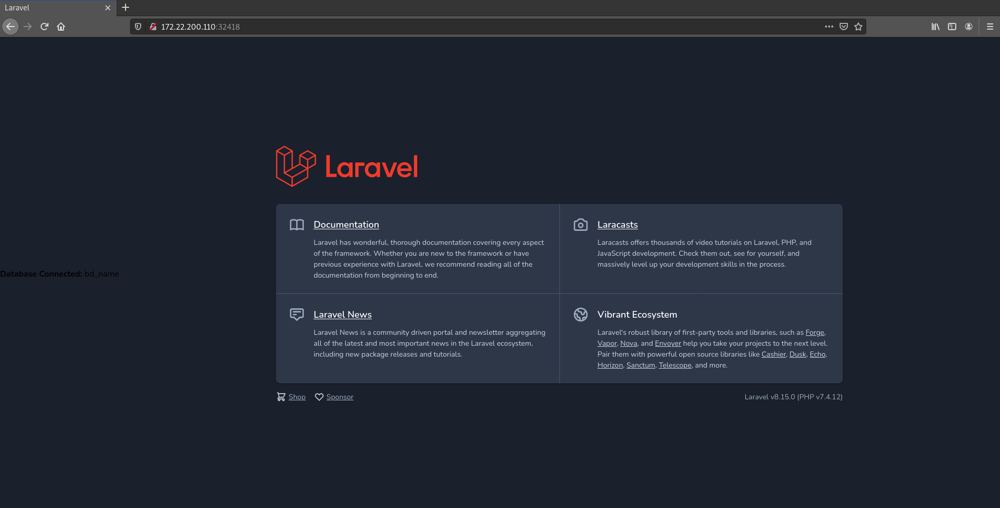
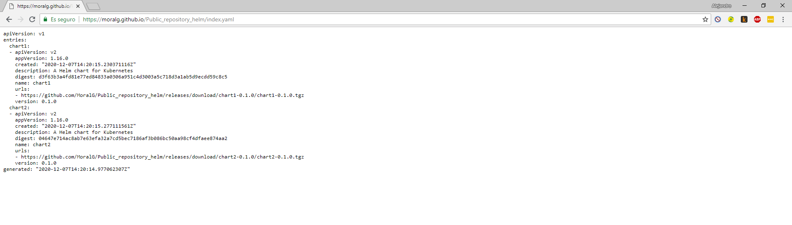

# Despliegues de microservicios en k8s con Helm

## Introdución

Helm es un administrador de paquetes para Kubernetes, que ayuda en el proceso de gestión de versiones a desplegar, su empaquetado, proceso de release (forward, rollback, upgrade), etc... de una manera más fácil y rápida.

Estos paquetes se denominan chart, los cuales son una colección de ficheros que describen un conjunto de recursos del API de Kubernetes. Un ejemplo comparable para entenderlo sería el caso del `apt` o `yum` u otros administradores de paquetes de distribuciones de linux pero para Kubernetes.

Las claves de la utilización de Helm son:

* Instalar automáticamente dependencias de software.
* Utilización de chart para la empaquetación de nuestras aplicaciones.
* Insteractuar con repositorios de chart, ya sean públicos o privados.
* Los Helm Charts sirven para describir incluso las aplicaciones más complejas. Ofrecen una instalación repetible de la aplicación, manteniendo un único punto de control.
* El proceso de “rollback” con Helm Charts es sencillo.
* Las actualizaciones de Helm Charts son sencillas y más fáciles de utilizar para los desarrolladores.
* Gestionar el ciclo de vida de despliegue de chart que han sido instaladas con Helm.

Helm es un proyecto oficial de Kubernetes y se esta empezado a utilizar mucho por la facilidad de los usuarios a la hora de trabajar con los paquetes de Kubernetes. Es mantenido por la CNCF en colaboración con Microsoft, Google, Bitnami y la comunidad de Helm.

En resumen, la principal función de Helm es definir, instalar y actualizar aplicaciones complejas de Kubernetes.

#### Requisitos previos

-------------------

* Un clúster de Kubernetes en la versión 1.8 o posterior, con el control de acceso en roles (RBAC) hablitado. Si necesita ayuda para instalar Kubernetes con kubeadm [LEER AQUÍ](https://github.com/MoralG/Trabajando_con_Kubernetes/blob/master/Trabajando_con_Kubernetes.md)

###### Comprobar la versión de Kubernetes:
~~~
kubectl version
    Client Version: version.Info{Major:"1", Minor:"18", GitVersion:"v1.18.2",   GitCommit:"52c56ce7a8272c798dbc29846288d7cd9fbae032", GitTreeState:"clean",   BuildDate:"2020-04-16T11:56:40Z", GoVersion:"go1.13.9", Compiler:"gc", Platform:"linux/amd64"}
    Server Version: version.Info{Major:"1", Minor:"18", GitVersion:"v1.18.2",   GitCommit:"52c56ce7a8272c798dbc29846288d7cd9fbae032", GitTreeState:"clean",   BuildDate:"2020-04-16T11:48:36Z", GoVersion:"go1.13.9", Compiler:"gc", Platform:"linux/amd64"}
~~~

--------------------------------------

* Tener la herramienta de líneas de comando `kubectl` instalada en su equipo local, configurada para poder conectarse al clúster.

###### Comprobar la conectividad:
~~~
kubectl cluster-info
    Kubernetes master is running at https://10.0.0.10:6443
    KubeDNS is running at https://10.0.0.10:6443/api/v1/namespaces/kube-system/services/kube-dns:dns/proxy
~~~

----------------

## Instalación de Helm

Vamos a instala la herramienta de linea de comando `helm` en nuestro equipo local de trabajo.

Descargamos la última release de Helm de la versión 3. Para hacer esto nos vamos a la [página oficial](https://github.com/helm/helm/releases) y nos descargamos el fichero `.tar.gz` para Linux

> #### NOTA 
> -----------------------
> Es recomendable que nos descarguemos una versión que este **Verificada**.

En el momento de la creación de este tutorial, nos descargamos la versión 3.2.0 de Helm.
~~~
wget https://get.helm.sh/helm-v3.3.4-linux-amd64.tar.gz
~~~

Descromprimimos el fichero:
~~~
tar -zxvf helm-v3.3.4-linux-amd64.tar.gz
~~~

Tenemos que mover el binario del directorio que hemos desempaquetado a la dirección, en mi caso, `/usr/local/bin/helm`

~~~
sudo mv linux-amd64/helm /usr/local/bin/helm
~~~

Comprobamos la versión
~~~
helm version
    version.BuildInfo{Version:"v3.2.0", GitCommit:"e11b7ce3b12db2941e90399e874513fbd24bcb71",   GitTreeState:"clean", GoVersion:"go1.13.10"}
~~~


> ##### NOTA
> --------------------
> Para mayor seguridad es recomendable quitar los permisos de lectura a los grupos para el fichero de configuración del cluster.
> Ejecutamos el siguiente comando:
> ````shell
> sudo chmod 600 /home/debian/.kube/mycluster.conf
> ````


Ya tenemos instalado Helm en la version 3, lo siguiente que vamos a ver es como iniciar el repositorio chart de Helm.

### Agregando un Helm Chart Repository

Vamos a agregar el repositorio de chart de Helm para poder instalar los chart que queramos.

~~~
helm repo add stable https://kubernetes-charts.storage.googleapis.com/
    "stable" has been added to your repositories
~~~

Una vez agregado, podemos listar los chart con el siguiente comando:

~~~
helm search repo stable
~~~

Nos saldrá una lista de chart oficiales para poder instalar en nuestro cluster

~~~
NAME                                 	CHART VERSION	APP VERSION            	DESCRIPTION
stable/acs-engine-autoscaler         	2.2.2        	2.1.1                  	DEPRECATED Scales worker nodes within agent pools
stable/aerospike                     	0.3.2        	v4.5.0.5               	A Helm chart for Aerospike in Kubernetes
stable/airflow                       	6.7.1        	1.10.4                 	Airflow is a platform to programmatically autho...
stable/ambassador                    	5.3.1        	0.86.1                 	A Helm chart for Datawire Ambassador
.
.
.
~~~

## Guía rápida

### Instalando un Chart oficial

Vamos a instalar un chart del repositorio oficial de Helm, para hacer esto tenemos que actualizar primero la información de los chart disponibles en el repositorio `stable` con el comando `helm repo update`.

> #### ESTRUCTURA DEL COMANDO
> --------------------
>* **`helm repo update [flags]`**
>
>###### [Para saber más sobre los comandos de helm](https://helm.sh/docs/helm/helm_repo_update/) o utilice `helm help` para una descripción general o utilice el parámetro `-h` para una descripción de un comando concreto

~~~
helm repo update
    Hang tight while we grab the latest from your chart repositories...
    ...Successfully got an update from the "stable" chart repository
    Update Complete. ⎈ Happy Helming!⎈
~~~

No ha salido un mensaje de que esta todo actualizado, ahora vamos a proceder a instalar un chart. En nuestro caso vamos a probar con MySQL.

Antes de empezar a instalar, tenenemos que saber el nombre del chart, para eso utilizamos el comando `helm search repo`.

> #### ESTRUCTURA DEL COMANDO
> --------------------
> * **`helm search repo [keyword] [flags]`**
> 
> ###### [Para saber más sobre los comandos de helm](https://helm.sh/docs/helm/helm_search_repo/) o utilice `helm help` para una descripción general o utilice el parámetro `-h` para una descripción de un comando concreto

Vamos a buscar la **release stable** de mysql, pero si queremos otras versiones podemos utilizar la flags `--devel` para prerelease o `--version [version]` para que nos muestre la version concreta.

~~~
helm search repo mysql
    NAME                            	CHART VERSION	APP VERSION	    DESCRIPTION
    stable/mysql                    	1.6.3        	5.7.28     	Fast, reliable, scalable, and easy to   use open-...
    stable/mysqldump                	2.6.0        	2.4.1      	A Helm chart to help backup MySQL   databases usi...
    stable/prometheus-mysql-exporter	0.5.2        	v0.11.0    	A Helm chart for prometheus mysql   exporter with...
    stable/percona                  	1.2.1        	5.7.26     	free, fully compatible, enhanced, open  source d...
    stable/percona-xtradb-cluster   	1.0.3        	5.7.19     	free, fully compatible, enhanced, open  source d...
    stable/phpmyadmin               	4.3.5        	5.0.1      	DEPRECATED phpMyAdmin is an mysql   administratio...
    stable/gcloud-sqlproxy          	0.6.1        	1.11       	DEPRECATED Google Cloud SQL     Proxy
    stable/mariadb                  	7.3.14       	10.3.22    	DEPRECATED Fast, reliable, scalable,    and easy t...
~~~

Nos ha listado todo lo que tiene que ver con el término **mysql** en su versión estable. Ahora vamos a instalar el chart **stable/mysql** con la versión 1.6.3 del chart.

Para instalar un chart tenemos que utilizar el comando `helm install`.

> #### ESTRUCTURA DEL COMANDO
> --------------------
> * **`helm install [NAME] [CHART] [flags]`**
> 
> ###### [Para saber más sobre los comandos de helm](https://helm.sh/docs/helm/helm_install/) o utilice `helm help` para una descripción general o utilice el parámetro `-h` para una descripción de un comando concreto

Vamos a asignarle el nombre de **maria** a nuestro chart, pero podemos utilizar la flags `--generate-name`para asignarle uno automáticamente.

~~~
helm install maria stable/mysql
~~~

Al instalar dicho chart, en el caso de mysql, nos sale una información del chart, como se muestra a continuación:

~~~
NAME: maria
LAST DEPLOYED: Thu Apr 23 17:09:13 2020
NAMESPACE: default
STATUS: deployed
REVISION: 1
NOTES:
MySQL can be accessed via port 3306 on the following DNS name from within your cluster:
maria-mysql.default.svc.cluster.local

To get your root password run:

    MYSQL_ROOT_PASSWORD=$(kubectl get secret --namespace default maria-mysql -o jsonpath="{.data.mysql-root-password}" | base64 --decode; echo)

To connect to your database:

1. Run an Ubuntu pod that you can use as a client:

    kubectl run -i --tty ubuntu --image=ubuntu:16.04 --restart=Never -- bash -il

2. Install the mysql client:

    $ apt-get update && apt-get install mysql-client -y

3. Connect using the mysql cli, then provide your password:
    $ mysql -h maria-mysql -p

To connect to your database directly from outside the K8s cluster:
    MYSQL_HOST=127.0.0.1
    MYSQL_PORT=3306

    # Execute the following command to route the connection:
    kubectl port-forward svc/maria-mysql 3306

    mysql -h ${MYSQL_HOST} -P${MYSQL_PORT} -u root -p${MYSQL_ROOT_PASSWORD}
~~~

> #### NOTA
> --------------------
> Si queremos ver la opciones configurables de un chart, podemos usar `helm show values <nombre_chart>`
> ~~~
> helm show values stable/mariadb
> ## Global Docker image parameters
> ## Please, note that this will override the image parameters, including dependencies, configured to use > the global value
> ## Current available global Docker image parameters: imageRegistry and imagePullSecrets
> ##
> # global:
> #   imageRegistry: myRegistryName
> #   imagePullSecrets:
> #     - myRegistryKeySecretName
> #   storageClass: myStorageClass
>
> ## Use an alternate scheduler, e.g. "stork".
> ## ref: https://kubernetes.io/docs/tasks/administer-cluster/configure-multiple-schedulers/
> ##
> # schedulerName:
>
> ## Bitnami MariaDB image
> ## ref: https://hub.docker.com/r/bitnami/mariadb/tags/
> ##
> image:
>   registry: docker.io
>   repository: bitnami/mariadb
>   tag: 10.3.22-debian-10-r27
> .
> .
> .
> ~~~
> Sabiendo las opciones que podemos configurar, podemos modificarlar de dos maneras:
> * Indicandole los parámetros en un fichero `.yaml` y luego indicarle dicho fichero en la instalación del chart.
>
> Creamos el fichero `yaml` indicandole las opciones
> ~~~
> echo '{mariadbUser: usuario1, mariadbDatabase: usuario_bd}' > prueba.yaml
> ~~~
> Indicamos el fichero `yaml` en la instalación, con el parámetro `-f`
> ~~~
> helm install -f prueba.yaml stable/mariadb --generate-name
> ~~~
> * Le indicamos las opciones con el parametro `--set`, en el moemnto de la instalación
> ~~~
> helm install stable/mariadb --generate-name --set name=usuario1
> ~~~

Ya tenemos instalado nuestro chart y nos muestra varia información, como la descripción, el nombre, el namespace, etc. Pero además nos muestra la instrucciones para conectarse a la base de datos.

Para ver los chart que estan lanzados con Helm podemos utilizar el comando `helm ls`.


~~~
helm ls
    NAME 	NAMESPACE	REVISION	UPDATED                                	STATUS  	CHART      	APP     VERSION
    maria	default  	1       	2020-04-23 17:39:05.877933281 +0000 UTC	deployed	mysql-1.6.3	5.7.28
~~~
### Actualizando un versión

Cuando se lanza una nueva versión de un chart, cuando desea cambiar la configuración de este, podemos usar `helm upgrade`

Una actualización toma una versión existente y la actualiza de acuerdo con la información que proporciones, en el caso de Helm solo se actualiza las cosas qie no han cambiado desde la última versión.

En este caso, para ver un ejemplo, vamos a cambiar la configuración del chart instalado anteriormente. Vamos a crear un fichero `yaml` con la opción `mariadbUser` modificada y creareamos una nueva versión.

~~~
echo '{mariadbUser: usuario1}' > prueba.yaml
~~~

~~~
helm upgrade -f prueba.yaml maria stable/mariadb
~~~

~~~
helm get values maria
    USER-SUPPLIED VALUES:
    mariadbUser: usuario1
~~~

~~~
helm history maria
    REVISION	UPDATED                 	STATUS     	CHART         	APP VERSION	DESCRIPTION
    1       	Thu Apr 23 16:30:03 2020	deployed   	mysql-1.6.3   	5.7.28    	Upgrade complete
~~~

### Desinstalando una versión

Para desinstalar una versión tenenemos que utilizar el comando `helm uninstall`.


> #### ESTRUCTURA DEL COMANDO
> --------------------
> * **`helm uninstall RELEASE_NAME [...] [flags]`**
> 
> ###### [Para saber más sobre los comandos de helm](https://helm.sh/docs/helm/helm_plugin_uninstall/) o utilice `helm help` para una descripción general o utilice el parámetro `-h` para una descripción de un comando concreto


Vamos a realizar la desinstalación del chart **maria** pero vamos a añadir el flag `--feep-history` para mantener el historial de versión.

~~~
helm uninstall maria --keep-history
    release "maria" uninstalled
~~~

Con este flag lo que conseguimos es poder rastrear las versiones incluso después de haberlas desinstalado, podiendo auditar el historial de un cluster e incluso recuperar una versión con el comando `helm rollback`.

Podemos ver con el comando `helm status`, el estado actual del chart.

~~~
helm status maria
NAME: maria
LAST DEPLOYED: Thu Apr 23 17:39:05 2020
NAMESPACE: default
STATUS: uninstalled
.
.
.
~~~

Nos muestra que ha sido desinstalada.

### Realizar un Rollback

Vamos a realizar un rollback para revertir una release a una versión anterior con el comando `helm rollback`.

> #### ESTRUCTURA DEL COMANDO
> --------------------
> * **`helm rollback <RELEASE> [REVISION] [flags]`**
> 
> ###### [Para saber más sobre los comandos de helm](https://helm.sh/docs/helm/helm_rollback/) o utilice `helm help` para una descripción general o utilice el parámetro `-h` para una descripción de un comando concreto

Si hemos borrado una versión de un chart y por consiguiente, no nos sale con el comando `helm ls` vamos a tener que utilizar `helm history`.

~~~
helm history maria
    REVISION	UPDATED                 	STATUS     	CHART      	APP VERSION	DESCRIPTION
    1       	Thu Apr 23 16:30:03 2020	deployed   	mysql-1.6.3   	5.7.28    	Upgrade complete
    2       	Thu Apr 23 17:39:05 2020	uninstalled	mysql-1.6.3	    5.7.28     	Uninstallation complete
~~~

Sabiendo esto vamos a realizar el **rollback**.

~~~
helm rollback maria 1
    Rollback was a success! Happy Helming!
~~~

Nos ha indicado que esta todo correcto y listamos de nuemo con `helm ls` los chart lanzados:

~~~
helm ls
    NAME 	NAMESPACE	REVISION	UPDATED                               	STATUS  	CHART      	APP     VERSION
    maria	default  	2       	2020-04-23 17:51:41.84658262 +0000 UTC	deployed	mysql-1.6.3	5.7.    28
~~~

Como podemos ver, el chart **maria** aparece de nuevo pero con una diferencia, la revisión es la número 2.

También podemos ver con `helm history` que nos aparece la revisión 1 desinstalada y la revisión 2 lanzada.

~~~
helm history maria
    REVISION	UPDATED                 	STATUS     	CHART      	APP VERSION	DESCRIPTION
    1       	Thu Apr 23 16:30:03 2020	deployed   	mysql-1.6.3   	5.7.28    	Upgrade complete
    2       	Thu Apr 23 17:39:05 2020	uninstalled	mysql-1.6.3	    5.7.28     	Uninstallation complete
    3       	Thu Apr 23 17:51:41 2020	deployed	mysql-1.6.3	    5.7.28     	Uninstallation complete
~~~

## Creando Charts en Helm

En esta guía vamos a desarrollar nuestros propios Charts en Helm. Es recomentable que se mire antes la [Instalación y configuración](https://github.com/MoralG/Despliegues_de_microservicios_en_k8s_con_Helm_y_OpenShift/blob/master/Proyecto.md#instalaci%C3%B3n-de-helm) de Helm y la [Guía rápida](https://github.com/MoralG/Despliegues_de_microservicios_en_k8s_con_Helm_y_OpenShift/blob/master/Proyecto.md#gu%C3%ADa-r%C3%A1pida).

Si quiere saber el funcionamiento de algunos comando de Helm puede ir a la [Guía de comandos](https://helm.sh/docs/helm/) de Helm.

Un Chart es una colección de ficheros que describen un cojunto de recursos de Kubernetes. Podemos usar un solo chart para implementar un pod memcached, o si nos vamos a algo mas complicado, una pila completa de aplicaciones web con servidores HTTP, bases de datos, cache, etc.

Es bueno tener unas prácticas recomendadas para crear un chart con Helm, por eso vamos a ir paso a paso creando el chart para una aplicación CRUD (Create, Read, Update, Delete) en Java y luego veremos como podemos sacarle partido a los chart oficiales o a los creados por la comunidad, desplegando un chart oficial `stable/lamp` pero añadiendo nuestros propios valores y secrets.

### Despliegue de Chart CRUD utilizando express.js y mongodb

Vamos a desplegar, con ayuda de Helm, un aplicación CRUD (Una aplicación simple donde se va a poder crear, leer, actualizar y eliminar datos) con la ayuda de Express.js (Es uno de los framework de aplicaciones para Node.js). También necesitaremos una base de datos, en nuestro caso vamos a utilizar Mongodb, y la introduciremos como dependencia.

Crearemos todos los objetos necesarios para el despliegue en Kubernetes con ficheros YAML, pero modificandolos para que sean funcionales para utilizarlos con Helm. Además, explicaremos para que se utilizan las dependencias en los chart de Helm.

> #### NOTA
> ----------------------
> Helm trabaja con un lenguaje de plantillas Go (Lenguaje de programación desarrollado por Google) añadidos a los fichero YAML de los objetos de Kubernetes.
> 
> Ejemplo:
> ````yaml
> apiVersion: v1
> kind: ConfigMap
> metadata:
>   name: {{ .Release.Name }}-configmap
> data:
>   myvalue: "Hola Mundo"
>   drink: {{ quote .Values.favorite.drink }}
>   food: {{ quote .Values.favorite.food }}
> ````
> Como podemos ver, se mete dentro de cuatros corchetes ``{{ }}`` y la estructura es muy fácil.
> ~~~~
> functionName arg1 arg2 ...
> ~~~~
> Hay varias tipos de funciones que podemos utilizar. Si quereís saber mas sobre los tipos de funciones que podemos utilizar [LEER AQUÍ](https://helm.sh/docs/chart_template_guide/function_list/)
> 
> Lo que hay que tener claro son los argumentos, ya que al utilizar `.Values`, el valor predeterminado que va a adquirir es el que le indicamos en el fichero `values.yaml`.
> 
> Ejemplo de fichero values.yaml:
> ~~~~
> favorite:
>   drink: coffee
>   food: pizza
> ~~~~
> Iremos explicando las funciones y argumentos que salgan en la configuración de nuestro despliegue.

Vamos a empezar creando el chart:

***debian@cliente:**~* **$** ``helm create app-crud``
~~~
Creating app-crud
~~~

Al crear un Chart, dispondremos de unos directorios en forma de árbol, los cuales podemos modificar y una vez terminado la modificación, Instalarlos con la versión indicada.

~~~
app-crud/
├── charts
|   └──
├── Chart.yaml
├── templates
│   ├── deployment.yaml
│   ├── _helpers.tpl
│   ├── ingress.yaml
│   ├── NOTES.txt
│   ├── service.yaml
│   └── tests
│       └── test-connection.yaml
└── values.yaml

3 directories, 8 files
~~~

Vamos a repasar los ficheros y directorios necesarios para realizar un buen despligue en Kubernetes.

|Objeto          | Descripción
|----------------|-------------------------------
|**charts/**| Directorio donde se añadiran los chart que necesitemos como dependencias.
|**Chart.yaml**| Fichero yaml que contiene la información del chart.
|**README.md**| Fichero utilizado para la descripción del chart.
|**values.yaml**| Fichero que contiene los distintos valores por defectos que le pasamos al chart.
|**templates/**| Directorio donde añadiremos los recursos de Kubernetes. Añadiremos los diferentes objetos mediante ficheros yaml.
|**templates/NOTES.txt**| Fichero opcional, que contiene breves notas de uso, estas se muestran al terminar el comando `helm install`.
|**templates/_helpers.tpl**| Fichero opcional, utilizado para definir algunos valores que pueden ser reutilizables en la creación del chart.

A partir de aquí tenemos que preguntarnos que vamos a necesitar.

* ¿Que imagen o imagenes vamos a utilizar?
* ¿Que dependencias necesitamos definir?
* ¿Para nuestra aplicación necesitamos volumenes persistentes?

#### Fichero Chart.yaml

Para empezar vamos a modificar los metadatos del fichero `Chart.yaml`.

```yaml
# Versión de la APi del chart, ira subiendo cada vez que hagamos un nuevo despliegue del chart.
apiVersion: v1
# Versión de la aplicación que vamos a desplegar.
appVersion: "1.0.0"
description: Aplicacion CRUD en Helm chart con express.js y mongodb.
# Nombre que le asignaremos al chart.
name: app-crud
# Versión del empaquetado del chart.
version: 0.1.0
# Alojamiento del chart.
sources:
- https://github.com/MoralG/appCRUD
maintainers:
- name: moralg
  email: ale95mogra@gmail.com
icon: https://res.cloudinary.com/practicaldev/image/fetch/s--5IllY723--/c_imagga_scale,f_auto,fl_progressive,h_900,q_auto,w_1600/https://thepracticaldev.s3.amazonaws.com/i/a3exuz06e9h212pandfr.png
```

Ahora vamos a definir la dependencia, dado que nuestra aplicación necesita la base de datos mongodb, debemos especificarla en el fichero `Chart.yaml` con el campo `dependencies`.

```yaml
dependencies:
# Nombre del chart.
- name: mongodb
# Versión del empaquetado del chart, en este caso la últma estable "latest". 
 version: latest
# Alojamiento donde la descargaremos.
 repository: https://kubernetes-charts.storage.googleapis.com/
# Opcional. Esto hará que el fichero "values.yaml" del chart principal se pueda añadir valores, mientras este el atributo "mongodb.enabled" en "true".
 condition: mongodb.enabled
```

Ya tenemos las dependencias definidas, ahora hay que sincronizar las dependencias deseadas y las dependencias reales almacenadas en el directorio `chart/`, para esto vamos a utilizar el comando `helm dep update`.

> #### ESTRUCTURA DEL COMANDO
> --------------------
> * **`helm dep update CHART [flags]`**
>
> ###### [Para saber más sobre los comandos de helm](https://helm.sh/docs/helm/helm_dependency_update/) o utilice `helm help` para una descripción general o utilice el parámetro `-h` para una descripción de un comando concreto

***debian@cliente:**~/app-crud* **$** `helm dep update`

```shell
Hang tight while we grab the latest from your chart repositories...
...Successfully got an update from the "django" chart repository
...Successfully got an update from the "bitnami" chart repository
...Unable to get an update from the "stable" chart repository (https://charts.helm.sh/stable):
        Get "https://charts.helm.sh/stable/index.yaml": dial tcp: lookup charts.helm.sh on 192.168.202.2:53: server misbehaving
Update Complete. ⎈Happy Helming!⎈
Saving 1 charts
Downloading mongodb from repo https://kubernetes-charts.storage.googleapis.com/
Deleting outdated charts
```

Como muestra en la salida del comando anterior, un chart se ha guardado. Comprobamos que se ha guardado en el directorio `chart/`.

***debian@cliente:**~/app-crud* **$** `ls -l charts/`

~~~
-rw-r--r-- 1 debian debian 5742 Nov 30 09:27 mongodb-2.0.5.tgz
~~~

#### Fichero deployment.yaml

Lo siguiente que tenemos que hacer es modificar un poco el fichero `deployment.yaml`, que es el recurso que se va a encargar de definir el control de réplicas, escabilidad de pods, etc...

Añadimos algunas label, para tener un control y una comodidad a la hora de listar y trabajar con los objetos que vamos a crear.

```yaml
labels:
  app: {{ template "express-crud.name" . }}
  chart: {{ template "express-crud.chart" . }}
  release: {{ .Release.Name }}
  heritage: {{ .Release.Service }}
```

> #### NOTA
> ----------------------
> La función **template** hace referencia al código definido en el fichero `_helpers.tlp`. Te lo muestro a continuación:
>
> ~~~~
> {{- define "express-crud.name" -}}
> {{- default .Chart.Name .Values.nameOverride | trunc 63 | trimSuffix "-" -}}
> {{- end -}}
> ~~~~
> Esto define el atributo `express-crud.name` con el nombre del chart extraido del fichero `Chart.yaml` y podemos unirle una cadena extra si añadimos el argumento `nameOverride` al fichero ``values.yaml``.
>
> ~~~~
> {{- define "express-crud.chart" -}}
> {{- printf "%s-%s" .Chart.Name .Chart.Version | replace "+" "_" | trunc 63 | trimSuffix "-" -}}
> {{- end -}}
> ~~~~
> Esto define el atributo `express-crud.chart` con el nombre unido a la version del chart extraido del fichero `Chart.yaml`.
>
> 
> Explicado esto, saber que: 
> 
> * `.Chart` hace referencia al fichero `Chart.yaml`.
> 
> * `.Values` hace referencia al fichero `values.yaml`.
> 
> * `.Release` hace referencia al nombre del objeto asignado en el despliegue.

Añadimos variables de entornos para configurar los valores del chart de mongodb.

```yaml
env:
- name: DATABASE_USER
  value: '{{ .Values.mongodb.mongodbUsername }}'
- name: DATABASE_NAME
  value: '{{ .Values.mongodb.mongodbDatabase }}'
- name: DATABASE_HOST
  value: '{{ .Release.Name }}-mongodb'
- name: DATABASE_PORT
  value: '27017'
- name: DATABASE_PASSWORD
  valueFrom:
    secretKeyRef:
      name: {{ .Release.Name }}-mongodb
      key: mongodb-password
```

* Valores del fichero `values.yaml` referentes a la parte de `Values.mongodb`:
```yaml
mongodb:
  mongodbRootPassword:
  mongodbUsername: admin
  mongodbPassword:
  mongodbDatabase: test
```

Modificamos el parámetro `image` para actualizar el chart de Helm con una nueva versión de la aplicación simplemente cambiando el valor en `Chart.yaml`.

```yaml
image: "{{ .Values.image.repository }}:{{ default .Chart.AppVersion .Values.image.tag }}"
```

> #### NOTA
> ----------------------
> La función **default** se utiliza para asignar un valor por defecto en el caso que no se especifique el atributo en el fichero ``values.yaml``.
> 
> Lo que quiere decir este parte del código ``{{ default .Chart.AppVersion .Values.image.tag }}`` es que si no se especifica un atributo `image.tag` en el fichero `values.yaml`, se extraerá del atributo `AppVersion` del fichero `Chart.yaml`.

* Valores del fichero `values.yaml` referentes a la parte de `Values.image`:
```yaml
image:
  repository: jainishshah17/express-mongo-crud
  # tag: 1.0.1
  pullPolicy: IfNotPresent
```

Añadimos las siguientes lineas para poder modificar los valores referente al puerto interno, protocolo, etc, desde el fichero `values.yaml`.

```yaml
ports:
- name: {{ .Values.service.name }}
  containerPort: {{ .Values.service.internalPort }}
  protocol: {{ .Values.service.protocol }}
```

Siempre es bueno agregar una prueba liveness y readiness para verificar el estado continuo de la aplicación. Para esto se utiliza las sondas.

```yaml
livenessProbe:
  httpGet:
    path: {{ .Values.livenessProbe.path }}
    port: {{ .Values.livenessProbe.port }}
  initialDelaySeconds: {{ .Values.livenessProbe.initialDelaySeconds }}
  periodSeconds: {{ .Values.livenessProbe.periodSeconds }}
  failureThreshold: {{ .Values.livenessProbe.failureThreshold }}
readinessProbe:
  httpGet:
    path: {{ .Values.readinessProbe.path }}
    port: {{ .Values.readinessProbe.port }}
  initialDelaySeconds: { .Values.readinessProbe.initialDelaySeconds }}
  periodSeconds: {{ .Values.readinessProbe.periodSeconds }}
  failureThreshold: {{ .Values.readinessProbe.failureThreshold }}
```

* Valores del fichero `values.yaml` referentes a la parte de `Values.livenessProbe` y `Values.readinessProbe`:
```yaml
livenessProbe:
  path: '/health'
  port: http
  initialDelaySeconds: 60
  periodSeconds: 10
  failureThreshold: 10 
  
readinessProbe:
  path: '/health'
  port: http
  initialDelaySeconds: 60
  periodSeconds: 10
  failureThreshold: 10 
```

Por último vamos a añadir un `initContainers` para mantener en pendiente el inicio de nuestra aplicación hasta que la base de datos esté en funcionamiento.

```yaml
initContainers:
- name: wait-for-db
  image: "{{ .Values.initContainerImage }}"
  command:
  - 'sh'
  - '-c'
  - >
    until nc -z -w 2 {{ .Release.Name }}-mongodb 27017 && echo mongodb ok;
      do sleep 2;
    done
```

* Valores del fichero `values.yaml` referentes a la parte de `Values.initContainers`:
```yaml
initContainerImage: "alpine:3.6"
```

> #### NOTA
> ------------------------
> Lo que realiza el código añadido en el `initContainers` es un bucle, de manera básica, mientras la condición sea falsa, "`until`", del contenedor ``{{ .Release.Name }}-mongodb``, tenga que esperar para iniciarse, por eso el comando `sleep`.

#### Fichero service.yaml

Ya tenemos nuestro fichero de despliegue listo, ahora vamos a modificar el fichero `service.yaml` para exponer nuestra aplicación al exterior.
Un servicio permite que la aplicación reciba trafico a través de una dirección IP. Los servicios se pueden exponer de diferentes formas especificando un tipo:


|Tipo            | Descripción
|----------------|-------------------------------
|**ClusterIP**| Solo se puede acceder al servicio mediante una IP interna desde el cluster.
|**NodePort**| Se puede acceder al servicio desde fuera del clúster a través de NodeIP y NodePort
|**LoadBalancer**| Se puede acceder al servicio desde fuera del clúster a través de un equilibrador de carga externo. Puede ingresar a la aplicación.

En nuestro caso vamos a utilizar LoadBalancer para la aplicación CRUD, ya que necesitamos acceder desde el exterior y el servicio de mongodb será ClusterIP, porque este solo tiene que poder tener acceso a la aplicación CRUD dentro del cluster.

Modificamos el fichero `service.yaml` para indicarle los valores de tipo de servicio, puerto externo, etc.

```yaml
spec:
  type: {{ .Values.service.type }}
  ports:
    - port: {{ .Values.service.externalPort }}
      targetPort: http
      protocol: {{ .Values.service.protocol }}
      name: {{ .Values.service.name }}
```


* Valores del fichero `values.yaml` referentes a la parte de `Values.service`:
```yaml
service:
  name: http
  type: LoadBalancer
  internalPort: 3000
  externalPort: 80
  protocol: TCP
```

Añadimos algunas label, para tener un control y una comodidad a la hora de listar y trabajar con los objetos que vamos a crear.

```yaml
labels:
  app: {{ template "express-crud.name" . }}
  chart: {{ template "express-crud.chart" . }}
  release: {{ .Release.Name }}
  heritage: {{ .Release.Service }}
```

#### Fichero values.yaml

Definir la mayoría de nuestras configuraciones en el fichero `values.yaml` es una práctica para ayudar a mantener los chart Helm en un buen estado de mantenimiento, además de ser mas fácil cambiar a otra configuración.

Vamos a ver como ha quedado el fichero `values.yaml`.

```yaml
# Default values for app-crud.
# This is a YAML-formatted file.
# Declare variables to be passed into your templates.

#------------------------------------------------

initContainerImage: "alpine:3.6"
imagePullSecrets:
replicaCount: 1

#------------------------------------------------

## Configuración de los valores referentes a la imagen de la aplicación CRUD

image:
  repository: jainishshah17/express-mongo-crud
# Puede descomentar el atributo "tag" y tendrá un peso mayor que el valor por defecto.
  # tag: 1.0.1
  pullPolicy: IfNotPresent

#------------------------------------------------

## Configuración de la dependencia de mongodb
## ref: https://github.com/kubernetes/charts/blob/master/stable/mongodb/README.md
##
mongodb:
  enabled: true
  image:
    tag: 3.6.3
    pullPolicy: IfNotPresent
  persistence:
    size: 50Gi
  mongodbExtraFlags:
  - "--wiredTigerCacheSizeGB=1"
  mongodbRootPassword:
  mongodbUsername: admin
  mongodbPassword:
  mongodbDatabase: test

#------------------------------------------------

## Configuración de los valores de Readiness and Liveness Probes (deployment.yaml)

livenessProbe:
  path: '/health'
  port: http
  initialDelaySeconds: 60
  periodSeconds: 10
  failureThreshold: 10 
  
readinessProbe:
  path: '/health'
  port: http
  initialDelaySeconds: 60
  periodSeconds: 10
  failureThreshold: 10 

#------------------------------------------------

# Configuración de valores referente a servicios (service.yaml, deployment.yaml)

service:
  name: http
  type: LoadBalancer
  internalPort: 3000
  externalPort: 80
  protocol: TCP

#------------------------------------------------

ingress:
  enabled: false

resources: {}

nodeSelector: {}

tolerations: []

affinity: {}
```

Al tener todo configurado, solo nos faltará instalar el chart pero antes examinaremos el chart para detectar posibles problemas con el comando `helm lint`

> #### ESTRUCTURA DEL COMANDO
> --------------------
> * **`helm lint PATH [flags]`**
> 
> ###### [Para saber más sobre los comandos de helm](https://helm.sh/docs/helm/helm_lint/) o utilice `helm help` para una descripción general o utilice el parámetro `-h` para una descripción de un comando concreto


***debian@cliente:**~/app-crud* **$** `helm lint ./`
```shell
==> Linting ./

1 chart(s) linted, 0 chart(s) failed
```

Cuando nos muestre el mensaje con 0 fallos, podemos realizar la instalación.

Es posible que salgan algunos fallitos referidos a la `apiVersion`, ya que dependiendo de que versión de helm utilices y dependiendo de la dependencia que elijas puede variar.

> #### NOTA
> --------------------------
> Ejemplo de error:
> ~~~
> Chart.yaml: dependencies are not valid in the Chart file with apiVersion 'v1'. They are valid in apiVersion 'v2'`
> ~~~
>
> Para arreglar este error tan solo deberiamos de cambiar en el fichero `Chart.yaml` la version del campo `apiVersion` a `v2`.

> #### NOTA
> --------------------------
> Recordad añadir un Persistent Volume, para que el Persistent Volume Claim se enlace. Dejo un fichero de configuración de un PV.
> ```yaml
> apiVersion: v1
> kind: PersistentVolume
> metadata:
>   name: task-pv-volume
>   labels:
>     type: local
> spec:
>   storageClassName: manual
>   capacity:
>     storage: 10Gi
>   accessModes:
>     - ReadWriteOnce
>   hostPath:
>     path: "/mnt/data"
> ```

Ahora si, vamos a realizar la instalación del chart, con el mismo comando que vimos anteriormente en la la guia rápida, `helm install`, este se encargara de desplegar los ficheros YAML de los objetos de Kubernetes inyectandole los valores que le hemos indicado en el fichero ``values.yaml``.

***debian@cliente:**~/app-crud* **$** `helm install app-crud ./`

~~~
NAME: app-crud
LAST DEPLOYED: Mon Nov 30 12:50:21 2020
NAMESPACE: default
STATUS: deployed
REVISION: 1
TEST SUITE: None
NOTES:
1. Get the application URL by running these commands:
     NOTE: It may take a few minutes for the LoadBalancer IP to be available.
           You can watch the status of by running 'kubectl get svc -w app-crud-express-crud'
  export SERVICE_IP=$(kubectl get svc --namespace default app-crud-express-crud -o jsonpath='{.status.loadBalancer.ingress[0].ip}')
  echo http://$SERVICE_IP:80
~~~

> #### NOTA
> --------------------
> Este mensaje que nos muestra lo podemos nosotros modificar editando el fichero `template/NOTES.txt`. Para tener el ejemplo, os dejo aquí el contenido que yo he utilizado:
> ~~~~
> 1. Get the application URL by running these commands:
> {{- if .Values.ingress.enabled }}
> {{- range .Values.ingress.hosts }}
>   http{{ if $.Values.ingress.tls }}s{{ end }}://{{ . }}{{ $.Values.ingress.path }}
> {{- end }}
> {{- else if contains "NodePort" .Values.service.type }}
>   export NODE_PORT=$(kubectl get --namespace {{ .Release.Namespace }} -o jsonpath="{.spec.ports[0].nodePort}" services {{ template "express-crud.fullname" . }})
>   export NODE_IP=$(kubectl get nodes --namespace {{ .Release.Namespace }} -o jsonpath="{.items[0].status.addresses[0].address}")
>   echo http://$NODE_IP:$NODE_PORT
> {{- else if contains "LoadBalancer" .Values.service.type }}
>      NOTE: It may take a few minutes for the LoadBalancer IP to be available.
>            You can watch the status of by running 'kubectl get svc -w {{ template "express-crud.fullname" . }}'
>   export SERVICE_IP=$(kubectl get svc --namespace {{ .Release.Namespace }} {{ template "express-crud.fullname" . }} -o jsonpath='{.status.loadBalancer.ingress[0].ip}')
>   echo http://$SERVICE_IP:{{ .Values.service.externalPort }}
> {{- else if contains "ClusterIP" .Values.service.type }}
>   export POD_NAME=$(kubectl get pods --namespace {{ .Release.Namespace }} -l "app={{ template "express-crud.name" . }},release={{ .Release.Name }}" -o jsonpath="{.items[0].metadata.name}")
>   echo "Visit http://127.0.0.1:{{ .Values.service.externalPort }} to use your application"
>   kubectl port-forward $POD_NAME {{ .Values.service.externalPort }}:80
> {{- end }}
> ~~~~

Como podemos ver, se ha instalado con exito y lo podemos listar con `helm list`.

***debian@cliente:**~/app-crud* **$** `helm list`

~~~
NAME            NAMESPACE       REVISION        UPDATED                                 STATUS          CHART                APP VERSION
app-crud        default         1               2020-11-30 12:50:21.429099337 +0000 UTC deployed        express-crud-0.1.0   1.0.1
~~~

Y podemos ver con el comando `kubectl get all` que se han creado los objetos que hemos ido editando en esta práctica:

***debian@cliente:**~/app-crud* **$** `kubectl get all`

~~~
NAME                                         READY   STATUS    RESTARTS   AGE
pod/app-crud-express-crud-565b97d46d-knwkh   1/1     Running   0          5m12s
pod/app-crud-mongodb-5cc7c8c7d7-pfpdn        1/1     Running   0          5m12s

NAME                            TYPE           CLUSTER-IP       EXTERNAL-IP   PORT(S)        AGE
service/app-crud-express-crud   LoadBalancer   10.109.130.120   <pending>     80:30853/TCP   5m12s
service/app-crud-mongodb        ClusterIP      10.111.146.0     <none>        27017/TCP      5m12s
service/kubernetes              ClusterIP      10.96.0.1        <none>        443/TCP        36d

NAME                                    READY   UP-TO-DATE   AVAILABLE   AGE
deployment.apps/app-crud-express-crud   1/1     1            1           5m12s
deployment.apps/app-crud-mongodb        1/1     1            1           5m12s

NAME                                               DESIRED   CURRENT   READY   AGE
replicaset.apps/app-crud-express-crud-565b97d46d   1         1         1       5m12s
replicaset.apps/app-crud-mongodb-5cc7c8c7d7        1         1         1       5m12s
~~~

Para acceder a nuestra aplicación utilizaremos el puerto externo del servicio de Loadbalancer.


-----------------------

Dos de los grandes beneficiones que obtenemos al utilizar Helm es poder modificar nuestro chart y actualizarlo de forma muy sencilla con el comando `helm upgrade` y la otra utilidad que vamos a ver a continuación es volver a un estado de la aplicación anterior, es decir, realizar un rollback a la version del chart que queramos con el comando `helm rollback`.


### Actualización de nuestro chart

Supongamos que queremos modificar nuestra aplicación y aumentar las réplicas. Para esto vamos a editar el fichero `values.yaml` y cambiamos el valor `replicaCount`.

###### Antes
````yaml
replicaCount: 1
````
###### Después
````yaml
replicaCount: 2
````
Y ejecutamos el comando `helm update`, esto hará que actualice a una versión nueva del chart.

Podemos ver que la versión del chart es 1.

***debian@cliente:**~/app-crud* **$** `helm list`
~~~~
NAME      NAMESPACE       REVISION        UPDATED                                 STATUS          CHART           APP VERSION
app-crud  default         1               2020-12-04 13:54:08.201085786 +0000 UTC deployed        app-crud-0.1.0  1.0.1
~~~~

Y si actualizamos:

***debian@cliente:**~/app-crud* **$** `helm upgrade app-crud ./`
~~~~
Release "app-crud" has been upgraded. Happy Helming!

NAME: app-crud
LAST DEPLOYED: Fri Dec  4 13:57:45 2020
NAMESPACE: default
STATUS: deployed
REVISION: 2
TEST SUITE: None
NOTES:
1. Get the application URL by running these commands:
     NOTE: It may take a few minutes for the LoadBalancer IP to be available.
           You can watch the status of by running 'kubectl get svc -w app-crud-app-crud'
  export SERVICE_IP=$(kubectl get svc --namespace default app-crud-app-crud -o jsonpath='{.status.loadBalancer.ingress[0].ip}')
  echo http://$SERVICE_IP:80
~~~~

Nos muestra un mensaje que el chart se ha actualizado, como podemos comprobarlo listando los chart.

***debian@cliente:**~/app-crud* **$** `helm list`
~~~~
NAME      NAMESPACE       REVISION        UPDATED                                 STATUS          CHART           APP VERSION
app-crud  default         2               2020-12-04 13:57:45.495586135 +0000 UTC deployed        app-crud-0.1.0  1.0.1
~~~~

Podemos comprobar también que se ha realizado el cambio con el comando `helm get values`.

***debian@cliente:**~/app-crud* **$** `helm get values --all app-crud | egrep replica`
````yaml
replicaCount: 2
````

Además si listamos los objetos pod que hay en el cluster de kubernetes, vermos que se esta creando un nuevo pod.

***debian@cliente:**~/app-crud* **$** `kubectl get pod`
~~~~
NAME                                     READY   STATUS            RESTARTS   AGE
app-crud-express-crud-565b97d46d-knwkh   1/1     Running           0          3m50s
app-crud-express-crud-757b4f78fb-tn5d4   0/1     PodInitializing   0          13s
app-crud-mongodb-5bc9679bcc-vk6qh        1/1     Running           0          3m50s
~~~~


### Realizar un Rollback a una version anterior del chart

Ya hemos actualizado nuestro chart y tenemos dos pod corriendo gracias a que hemos aumentado 2 el valor de la replica pero imaginaros que la aplicación entra en estado de error y queremos volver a la version anterior del chart.

Ejecutamos el comando `helm upgrade`, este comando revierte una versión (en nuestro caso la versión 2) a una versión anterior (queremos volver a la versión 1). El primer argumento del comando de rollback es el nombre de una versión y el segundo es un número de revisión (versión). Si se omite este argumento, se revertirá a la versión anterior.

Para ver los números de revisión, ejecutamos el comando `helm history`

***debian@cliente:**~/app-crud* **$** `helm history app-crud`
~~~~
REVISION        UPDATED                         STATUS          CHART           APP VERSION     DESCRIPTION
1               Fri Dec  4 13:54:08 2020        superseded      app-crud-0.1.0  1.0.1           Install complete
2               Fri Dec  4 13:57:45 2020        deployed        app-crud-0.1.0  1.0.1           Upgrade complete
~~~~

Queremos volver a la revisión 1:

***debian@cliente:**~/app-crud* **$** `helm rollback prueba 1`
~~~~
Rollback was a success! Happy Helming!
~~~~

Y si listamos las revisiones de nuevo:

***debian@cliente:**~/app-crud* **$** `helm history app-crud`
~~~~
REVISION        UPDATED                         STATUS          CHART           APP VERSION     DESCRIPTION
1               Fri Dec  4 13:54:08 2020        superseded      app-crud-0.1.0  1.0.1           Install complete
2               Fri Dec  4 13:57:45 2020        superseded      app-crud-0.1.0  1.0.1           Upgrade complete
3               Fri Dec  4 14:06:43 2020        deployed        app-crud-0.1.0  1.0.1           Rollback to 1
~~~~

Mostramos el valor del atributo replica:

***debian@cliente:**~/app-crud* **$** `helm get values --all app-crud | egrep replica`
````yaml
replicaCount: 1
````

Y por útltimo, podemos ver que esta pod nuevo esta en estado `Terminating`

***debian@cliente:**~/app-crud* **$** `kubectl get pod`
~~~~
NAME                                     READY   STATUS            RESTARTS   AGE
app-crud-express-crud-565b97d46d-knwkh   1/1     Running           0          12m
app-crud-express-crud-757b4f78fb-tn5d4   0/1     Terminating       0          16s
app-crud-mongodb-5bc9679bcc-vk6qh        1/1     Running           0          12m
~~~~

-----------------------

### Despliegue de Chart de aplicación PHP utilizando Laravel y MySQL

Vamos a desplegar una nueva aplicación PHP de Laravel 7 (es un frameworks de aplicaciones PHP de código abierto mas populares). Este lo vamos a implementar con una vase de datos MySQL con ayuda del chart oficial `stable/lamp`.

Para el despliegue de esta aplicación vamos a utilizar una imagen docker `moralg/larabel-kubernetes`, la cual he creado con docker compose y subido a mi repositorio de [Docker Hub](https://hub.docker.com/repository/docker/moralg/laravel-kubernetes) para utilizarla esta práctica.

> #### NOTA
> ----------------------
> La aplicación de larabel la he cogido prestada del repositorio oficial de Larabel en [Github](https://github.com/laravel/laravel).

Antes de realizar la instalación del chart, he añadido una pequeña modificación al fichero `larabel/resources/views/welcome.blade.php`

````html
<div class="links">
   <strong>Database Connected: </strong>
    @php
        try {
            DB::connection()->getPDO();
            echo DB::connection()->getDatabaseName();
            } catch (\Exception $e) {
            echo 'None';
        }
    @endphp
</div>
````

Este pequeño fragmento de código lo que hace es probar la conexión de la base de datos y muestrará el nombre si realiza la conexión.

También te dejo aquí el código del docker compose para tenerlo presente a la hora de crear los fichero necesarios para el despliegue de nuestro chart.

````yaml
version: '3.5'
services:
  php:
    image: moralg/laravel-kubernetes:latest
    restart: always
    ports:
      - 8000:80
    environment:
      - APP_KEY=base64:8thPzqcZG1NC8ga7TYrXQqEBXozhK5RgMqPVltVr9Ig=
      - APP_ENV=local
      - APP_DEBUG=true
      - DB_PORT=3306
      - DB_HOST=mysql
      - DB_DATABASE
      - DB_USERNAME
      - DB_PASSWORD
  mysql:
    image: mysql:5.7
    restart: always
    environment:
      - MYSQL_ROOT_PASSWORD=${DB_ROOT_PASSWORD}
      - MYSQL_DATABASE=${DB_DATABASE}
      - MYSQL_USER=${DB_USERNAME}
      - MYSQL_PASSWORD=${DB_PASSWORD}
````

Como podemos ver, en el fichero del docker compose, le indicamos las variables de entorno que vamos a añadir a nuestro fichero values.yaml (en este fichero los datos no confidenciales) y en el secrets.yaml (los datos confidenciales).

> #### NOTA
> ----------------------
> Además hay que tener en cuenta que el chart ofcial que vamos a utilizar tiene una serie de valores que podemos modificar. 
> 
> Te dejo el repositorio de Github de para que puedas mirar los valores. [stable/lamp](https://github.com/helm/charts/tree/master/stable/lamp)

Ya que tenemos todo claro podemos comenzar a crear nuestros dos ficheros, los unicos que nos hace falta para desplegar una aplicación con Helm.

Creamos el fichero `values.yaml` y añadimos el siguiente código.

````yaml
php:
  repository: "moralg/laravel-kubernetes"
  tag: "latest"
  fpmEnabled: false
  envVars:
    - name: APP_ENV
      value: pro
    - name: APP_DEBUG
      value: false
    - name: DB_PORT
      value: 3306
    - name: DB_HOST
      value: localhost
````
En el fichero `values.yaml` hemos añadido los valores de ``repositorio`` y la `tag` para indicar la imagen de docker de la aplicación Larabel.
Tabién hemos indicado las variables de entorno no confidenciales, modificadas a nuestro a nuestras necesidades.

Creamos el fichero `secrets.yaml` y añadimos el siguiente código.

````yaml
mysql:
  rootPassword: "bd_root_pass"
  user: bd_user
  password: "bd_pass"
  database: bd_name

php:
  envVars:
    - name: APP_KEY
      value: "base64:8thPzqcZG1NC8ga7TYrXQqEBXozhK5RgMqPVltVr9Ig="
    - name: DB_DATABASE
      value: bd_name
    - name: DB_USERNAME
      value: bd_user
    - name: DB_PASSWORD
      value: "bd_pass"
````

En el fichero `secrets.yaml` hemos añadido las variables confidenciales de la base de datos, y con los mismos valores se la hemos asignado a las variables confidenciales de nuestra aplicación php, para que tenga acceso a MySQL. 

Una vez que tengamos creado estos dos ficheros vamos a instalar el chart con el comando `helm install` y añadiendo el parámetro `-f` para indicar los ficheros, además de el chart oficial `stable/lamp`

***debian@cliente:**~/app-larabel* **$** `helm install laravel-kubernetes -f values.yaml -f secrets.yaml stable/lamp`
~~~~
NAME: laravel
LAST DEPLOYED: Fri Dec  4 12:11:24 2020
NAMESPACE: default
STATUS: deployed
REVISION: 1
TEST SUITE: None
NOTES:
INIT:
      Please wait for all init containers to finish before connecting to
      the charts services. This might take a few minutes depending on their
      tasks.

LOADBALANCER:
      Please wait until the service has been routed to an IP address.
      You can watch the status of by running 'kubectl get svc -w laravel-lamp'

1. You can now connect to the following services:
      export CHARTIP=$(kubectl get svc laravel-lamp --output=jsonpath={.status.loadBalancer.ingress..ip})

      Main Site:
        http://$CHARTIP
~~~~

> #### NOTA
> ----------------------
> Es necesario crear un Volume Persistent, dejo un fichero YAML del objeto para crearlo:
> ````yaml
> apiVersion: v1
> kind: PersistentVolume
> metadata:
>   name: volume-mysql
>   labels:
>     type: local
> spec:
>   capacity:
>     storage: 10Gi
>   accessModes:
>     - ReadWriteOnce
>   hostPath:
>     path: "/mnt"
> ````
> Y ejecutamos lo siguiente:
> 
> ***debian@cliente:**~* **$** `kubectl app install laravel-kubernetes -f values.yaml -f secrets.yaml stable/lamp`

Podemos ver que todo esta funcionando como en la práctica anterior, listando todos los objetos:

***debian@cliente:**~* **$** `kubectl get all`
~~~~
NAME                                READY   STATUS    RESTARTS   AGE
pod/laravel-lamp-68dffb6495-9hlx6   2/2     Running   0          48m

NAME                   TYPE           CLUSTER-IP      EXTERNAL-IP   PORT(S)                       AGE
service/kubernetes     ClusterIP      10.96.0.1       <none>        443/TCP                       40d
service/laravel-lamp   LoadBalancer   10.103.15.225   <pending>     80:32418/TCP,3306:30419/TCP   48m

NAME                           READY   UP-TO-DATE   AVAILABLE   AGE
deployment.apps/laravel-lamp   1/1     1            1           48m

NAME                                      DESIRED   CURRENT   READY   AGE
replicaset.apps/laravel-lamp-68dffb6495   1         1         1       48m
~~~~

Y para acceder a nuestra aplicación desde http, tenemos que poner en el navegador la ip del servidor y el puerto externo asignado al httpd, en este caso el **32418**.



----------

### Creación de un repositorio público

Podemos alojar y compartir chart de Helm a través de un repositorio de Helm, que es efectivamente un sitio web estático con un fichero `index.yaml`, compuesto de metadatos y enlaces a los chart de Helm.

Esto hace que se pueda alojar un repositorio en Github Pages, S3 de AWS, Almacenamiento en la nube de Google, etc. En esta práctica vamos a utilizar Github Pages, ya que tenemos el repositorio (Github) y el sitio web (Github Pages) en el mismo lugar.

Empezamos creando un repositorio en Github, yo lo llamaré [Public_repository_helm](https://github.com/MoralG/Public_repository_helm/tree/repo-helm).


Clonamos el repositorio en nuestro equipo:

***debian@cliente:**~* **$** `git clone git@github.com:MoralG/Public_repository_helm.git`
~~~~
Cloning into 'Public_repository_helm'...
remote: Enumerating objects: 3, done.
remote: Counting objects: 100% (3/3), done.
remote: Compressing objects: 100% (2/2), done.
remote: Total 3 (delta 0), reused 0 (delta 0), pack-reused 0
Receiving objects: 100% (3/3), done.
~~~~

El sigueinte paso es añadir algunos charts de Helm, vamos a utilizar los chart que se crean por defecto al utilizar `helm create` para realizar la práctica mas rápido.

***debian@cliente:**~/Public_repository_helm* **$** `mkdir charts`

***debian@cliente:**~/Public_repository_helm/charts* **$** `helm create chart1 && helm create chart2`
~~~~
Creating chart1
Creating chart2
~~~~

***debian@cliente:**~/Public_repository_helm/charts* **$** `tree`
~~~~
.
├── chart1
│   ├── charts
│   ├── Chart.yaml
│   ├── templates
│   │   ├── deployment.yaml
│   │   ├── _helpers.tpl
│   │   ├── hpa.yaml
│   │   ├── ingress.yaml
│   │   ├── NOTES.txt
│   │   ├── serviceaccount.yaml
│   │   ├── service.yaml
│   │   └── tests
│   │       └── test-connection.yaml
│   └── values.yaml
└── chart2
    ├── charts
    ├── Chart.yaml
    ├── templates
    │   ├── deployment.yaml
    │   ├── _helpers.tpl
    │   ├── hpa.yaml
    │   ├── ingress.yaml
    │   ├── NOTES.txt
    │   ├── serviceaccount.yaml
    │   ├── service.yaml
    │   └── tests
    │       └── test-connection.yaml
    └── values.yaml

8 directories, 20 files
~~~~

Ahora vamos a preparar Github Pages, tenemos que habilitarlas en el repositorio git y también vamos a crear una rama vacía, la llamaremos `repo-helm`.

Creamos la rama vacia así:

***debian@cliente:**~/Public_repository_helm* **$** `git checkout --orphan repo-helm`
~~~~
Switched to a new branch 'repo-helm'
~~~~

Añadimos a la rama `repo-helm` los charts: 

***debian@cliente:**~/Public_repository_helm* **$** `git add *`

***debian@cliente:**~/Public_repository_helm* **$** `git commit -m "Charts añadidios"`
~~~~
[repo-helm (root-commit) 5a8be27] Charts añadidios
 Committer: Debian <debian@cliente.novalocal>
Your name and email address were configured automatically based
on your username and hostname. Please check that they are accurate.
You can suppress this message by setting them explicitly. Run the
following command and follow the instructions in your editor to edit
your configuration file:

    git config --global --edit

After doing this, you may fix the identity used for this commit with:

    git commit --amend --reset-author

 23 files changed, 762 insertions(+)
 create mode 100644 README.md
 create mode 100644 charts/chart1/.helmignore
 create mode 100644 charts/chart1/Chart.yaml
 create mode 100644 charts/chart1/templates/NOTES.txt
 create mode 100644 charts/chart1/templates/_helpers.tpl
 create mode 100644 charts/chart1/templates/deployment.yaml
 create mode 100644 charts/chart1/templates/hpa.yaml
 create mode 100644 charts/chart1/templates/ingress.yaml
 create mode 100644 charts/chart1/templates/service.yaml
 create mode 100644 charts/chart1/templates/serviceaccount.yaml
 create mode 100644 charts/chart1/templates/tests/test-connection.yaml
 create mode 100644 charts/chart1/values.yaml
 create mode 100644 charts/chart2/.helmignore
 create mode 100644 charts/chart2/Chart.yaml
 create mode 100644 charts/chart2/templates/NOTES.txt
 create mode 100644 charts/chart2/templates/_helpers.tpl
 create mode 100644 charts/chart2/templates/deployment.yaml
 create mode 100644 charts/chart2/templates/hpa.yaml
 create mode 100644 charts/chart2/templates/ingress.yaml
 create mode 100644 charts/chart2/templates/service.yaml
 create mode 100644 charts/chart2/templates/serviceaccount.yaml
 create mode 100644 charts/chart2/templates/tests/test-connection.yaml
 create mode 100644 charts/chart2/values.yaml
~~~~

***debian@cliente:**~/Public_repository_helm* **$** `git push origin repo-helm`
~~~~
Enumerating objects: 31, done.
Counting objects: 100% (31/31), done.
Delta compression using up to 2 threads
Compressing objects: 100% (29/29), done.
Writing objects: 100% (31/31), 6.28 KiB | 3.14 MiB/s, done.
Total 31 (delta 10), reused 1 (delta 0)
remote: Resolving deltas: 100% (10/10), done.
remote:
remote: Create a pull request for 'repo-helm' on GitHub by visiting:
remote:      https://github.com/MoralG/Public_repository_helm/pull/new/repo-helm
remote:
To github.com:MoralG/Public_repository_helm.git
 * [new branch]      repo-helm -> repo-helm
~~~~

Ahora habilitamos Github Pages en los ajustes de nuestro repositorio. La dirección es `Settings > Options > GitHub Pages`.

Le indicamos la rama `repo-helm`, el directorio raíz `/(root)` y le damos a guardar `Save`.


Esperamos unos segundos y podremos acceder a la URL que nos proporciona Github Pages.


Podemos utilizar un combinación de los comandos `helm package` y `helm repo` para construir nuestro repositorio de Helm a mano, o podemos utilizar `chart-releaser` que además de crear nuestros paquetes, nos los cargará como binarios, en una versión de Github, con la versión adecuada.

Nos descargaremos la última versión de `chart-releaser` desde el repositorio de [Helm en Github](https://github.com/helm/chart-releaser/releases) y descomprimimos el fichero con `tar`.

***debian@cliente:**/tmp* **$** `curl -sSL https://github.com/helm/chart-releaser/releases/download/v0.2.1/chart-releaser_0.2.1_linux_amd64.tar.gz | tar xzf -`

Movemos el del binario a `/bin/cr`

***debian@cliente:**/tmp* **$** `sudo mv cr /bin/cr`

Comprobamos que esta instalado y la versión:

***debian@cliente:**~* **$** `cr version`
~~~~
Version:         v0.2.1
Git commit:      5132b262ef33b074bf47ce8ee446433849e93873
Date:            2019-05-23T06:19:20Z
License:         Apache 2.0
~~~~

Hay dos comandos que nos interesan, `cr index` (creará un fichero `index.yaml`) y `cr upload` (cargará los paquetes a las versiones de Github). Para esto último, necesitamos un token de Github para que pueda utilizar la API.

La dirección para crear un token es: `Settins - Developer settings - Personal access tokens`. Seleccionamos `Generate new token` y le asignamos un nombre y marcamos los ámbitos: `repo`, `workflow`, `write:packages`, `delete:packages`.

Creamos una variable de entorno con el token de acceso.

***debian@cliente:**~* **$** ` export CR_TOKEN=b67e55c97bcaa440d75de4258a2e79b551101c5f`

Nuestro siguiente paso es crear y cargar los paquetes, para esto vamos a utilizar el comndo `helm package`

Tenemos que crear un directorio para los paquetes que vamos a cargar, además de añadirlo al fichero `.gitignore` para que no se suba a nuestro repositorio.

***debian@cliente:**~/Public_repository_helm* **$** `echo ".deploy" >> .gitignore`

***debian@cliente:**~/Public_repository_helm* **$** `helm package charts/{chart1,chart2} --destination .deploy`
~~~~
Successfully packaged chart and saved it to: .deploy/chart1-0.1.0.tgz
Successfully packaged chart and saved it to: .deploy/chart2-0.1.0.tgz
~~~~

Podemos ver que se ha creado dos paquetes, el nombre se ha generado con la versión que tenemos asignada en el fichero `Chart.yaml`, esta versión también será la misma que la del `tag` de la release de Github.

***debian@cliente:**~/Public_repository_helm* **$** `ls .deploy/`
~~~~
chart1-0.1.0.tgz  chart2-0.1.0.tgz
~~~~

Ejecutamos `cr upload` para crear versiones y cargar los paquetes.

***debian@cliente:**~/Public_repository_helm* **$** `cr upload -o moralg -r Public_repository_helm -p .deploy -t <<<TOKEN>>>`

Con este comando le indicamos el propietario del repositorio `-o`, el nombre del repositorio `-r` el directorio donde se almacenan los paquetes `-p` y el token de acceso `-t`.

Al ejecutar el comando, no nos devuelve ninguna salida. Si todo ha salido bien, tendremos en nuestro repositorio dos release.


Continuamos con la creación del fichero `index.yaml` y posteriormente subirlo 

Seleccionamos la rama `repo-helm`

***debian@cliente:**~/Public_repository_helm* **$** `git checkout repo-helm`
~~~~
Already on 'repo-helm'
~~~~

Creamos el fichero `index.yaml` añadiendo los datos del propietario y del repositorio.
***debian@cliente:**~/Public_repository_helm* **$** `cr index -i ./index.yaml -p .deploy -o moralg -r Public_repository_helm`
~~~~
====> UpdateIndexFile new index at ./index.yaml
====> Found chart1-0.1.0.tgz
====> Extracting chart metadata from .deploy/chart1-0.1.0.tgz
====> Calculating Hash for .deploy/chart1-0.1.0.tgz
====> Found chart2-0.1.0.tgz
====> Extracting chart metadata from .deploy/chart2-0.1.0.tgz
====> Calculating Hash for .deploy/chart2-0.1.0.tgz
--> Updating index ./index.yaml
~~~~

Ahora tendríamos que tener un fichero `index.yaml` creado con los detalles de los charts y la ruta de sus ficheros.

~~~~
apiVersion: v1
entries:
  chart1:
  - apiVersion: v2
    appVersion: 1.16.0
    created: "2020-12-07T14:20:15.230371116Z"
    description: A Helm chart for Kubernetes
    digest: d3f63b3a4fd81e77ed84833a0306a951c4d3003a5c718d3a1ab5d9ecdd59c8c5
    name: chart1
    urls:
    - https://github.com/MoralG/Public_repository_helm/releases/download/chart1-0.1.0/chart1-0.1.0.tgz
    version: 0.1.0
  chart2:
  - apiVersion: v2
    appVersion: 1.16.0
    created: "2020-12-07T14:20:15.277111561Z"
    description: A Helm chart for Kubernetes
    digest: 04647e714ac8ab7e63efa32a7cd5bec7186af3b086bc50aa98cf4dfaee874aa2
    name: chart2
    urls:
    - https://github.com/MoralG/Public_repository_helm/releases/download/chart2-0.1.0/chart2-0.1.0.tgz
    version: 0.1.0
generated: "2020-12-07T14:20:14.977062307Z"
~~~~

Subimos el fichero `index.yaml` a nuestro repositorio y comprobamos que existe en Github Pages.



Vamos a probar nuestro nuevo repositorio. Añadimos el repositorio con el comando `helm repo add` y utilizando el nombre de nuestro repositorio y la dirección de Github Pages.

***debian@cliente:**~* **$** `helm repo add public_repository_helm https://moralg.github.io/Public_repository_helm/`
~~~~
"public_repository_helm" has been added to your repositories
~~~~

Lo listamos para asegurarnos que esta añadido:

***debian@cliente:**~* **$** `helm repo list`
~~~~
NAME                    URL
django                  https://itswcg.github.io/django-helm/charts/
bitnami                 https://charts.bitnami.com/bitnami
stable                  https://charts.helm.sh/stable
public_repository_helm  https://moralg.github.io/Public_repository_helm/
~~~~

Ya tenemos nuestro repositorio creado y añadido a nuestro Helm, lo último que podemos hacer es instalar uno de los chart que hemos añadido a nuestro repositorio.

***debian@cliente:**~* **$** `helm install test public_repository_helm/chart1`

~~~~
NAME: test
LAST DEPLOYED: Mon Dec  7 14:34:08 2020
NAMESPACE: default
STATUS: deployed
REVISION: 1
NOTES:
1. Get the application URL by running these commands:
  export POD_NAME=$(kubectl get pods --namespace default -l "app.kubernetes.io/name=chart1,app.kubernetes.io/instance=test" -o jsonpath="{.items[0].metadata.name}")
  echo "Visit http://127.0.0.1:8080 to use your application"
  kubectl --namespace default port-forward $POD_NAME 8080:80
~~~~

***debian@cliente:**~* **$** `kubectl get pod`
~~~~
NAME                               READY   STATUS    RESTARTS   AGE
test-chart1-7979df9f94-nv5kk       1/1     Running   0          97s
~~~~

## Siguientes Pasos

Los siguientes pasos que se podrían realizar para ampliar esta práctica sería la utilización de Helmfile.

Helmfile permite declarar una definición de un cluster de Kubernetes completo en un solo fichero YAML, agrupa múltiples versiones de Helm (instalación de chart de Helm) y permite ajustar una especificación de cada versión en función de un tipo de entorno (desarrolo, prueba, producción) en el que es posible que desee implementar sus aplicaciones.

También podríamos automatizar las actualizaciones de los chart de Helm para nuestro repositorio con [CicleCI](https://circleci.com/). Es un servicio de integración continua muy utilizado por la comunidad de Helm.

## Conclusiones

Después de haber trabajado con Helm, a la conclusión que he llegado, es que al principio cuesta un poco comprender la integración de los objetos de Kubernetes con la sintaxis de Go para crear variables y tener todos los valores en el fichero `values.yaml`, pero una vez controlado, el proceso de gestionar una aplicación en charts a través de helm es mas cómodo. A la hora de realizar un cambio y actualizar la versión, como también lo sencillo que podemos revertir cualquier fallo o configuración no deseada con rollback.

## Webgrafía

Helm. The Chart Template Developer's Guida.

https://helm.sh/docs/chart_template_guide/


Helm. Quickstart Guide.

https://helm.sh/docs/intro/quickstart/

Helm. Installing Helm.

https://helm.sh/docs/intro/install/

Helm. Using Helm.

https://helm.sh/docs/intro/using_helm/

Helm. The Chart Best Practices Guide
.
https://helm.sh/docs/chart_best_practices/

Helm. Helm Command.

https://helm.sh/docs/helm/

Jfrog. Steering Straight with Helm Chart Best Practices.

https://jfrog.com/blog/helm-charts-best-practices/

DigitalOcean. Cómo implementar Laravel7 y MySQL en Kubernetes con Helm.

https://www.digitalocean.com/community/tutorials/how-to-deploy-laravel-7-and-mysql-on-kubernetes-using-helm-es

Tech. Creating a Helm Chart Repository - Part 1

https://tech.paulcz.net/blog/creating-a-helm-chart-monorepo-part-1/